.. _mapping_tools:

Mapping Tools
=============

QAequilibraE has some tools to allow the user to visualize the data.

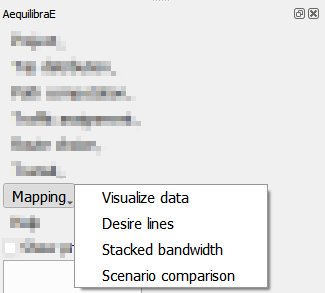

.. _mapping_visualize_data:

Visualize data
--------------

When clicking **Mapping > Visualize data**, a new window with three different tabs opens.
The tab *Matrices* present all matrices available for the current project.

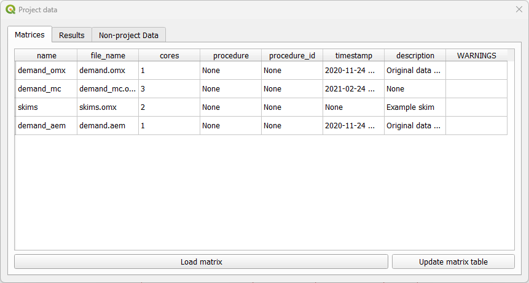

As for the tab *Results* it displays the results of procedures that took place and that are
saved in the project 'results_database.sqlite' file.

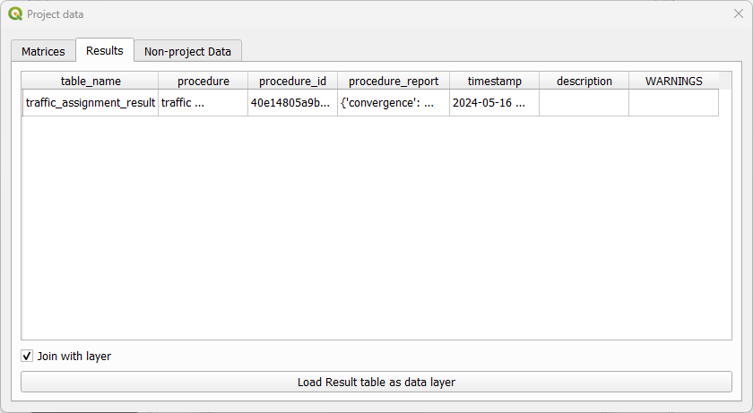

The tab *Non-project data* allows you to open and visualize matrices stored in \*.omx format. 
**This is the only tab available if no AequilibraE project is open**. Suppose you 
want to check a skim matrix from a previous project. When clicking the **Load data** button, you can point 
AequilibraE the location of the file and its visualization is displayed.

.. _fig_nonproject_data:

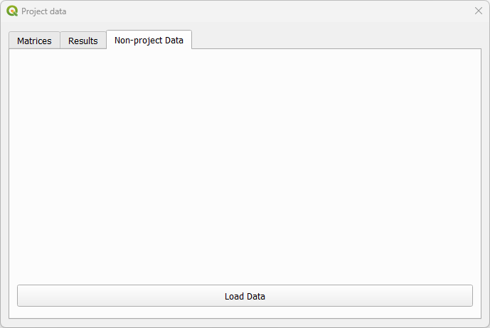

Check the figure below to see how the visualization window looks like! General configurations for data displaying
such as the number of decimal places and the usage of thousand separator are available. In case your file has more 
than one view, you can select the desired view using the dropdown buttons at the bottom of the page. In our figure,
they are represented by the dropdowns containing *distance_blended* and *main_index*. To save your current matrix 
into \*.csv format, just click in the *export* button in the lower left corner of the window.

.. _fig_data_visualize_matrices:

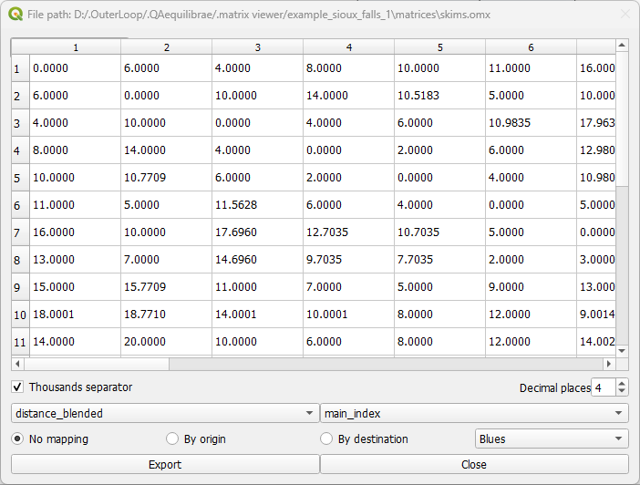

Additionally, we can visualize how the matrices look like in the map! Using the buttons
*By origin* and *By destination*, it is possible to select the traffic zone by its origin or 
destination. If one select *By origin*, then click on the desired row, and notice that is going
to be highlighted. The *zones* layer (if it exists) is going to be loaded and the corresponding
zones are going to receive a different color shade, according to the color palette selected in
the dropdown menu. One other possibility to select the zone for displaying is directly into the
map canvas: with the *Select features* button enabled, just click on the desired zone in the
layer and you'll notice that the color shades change accordingly, as well as the row selection
in the matrix.

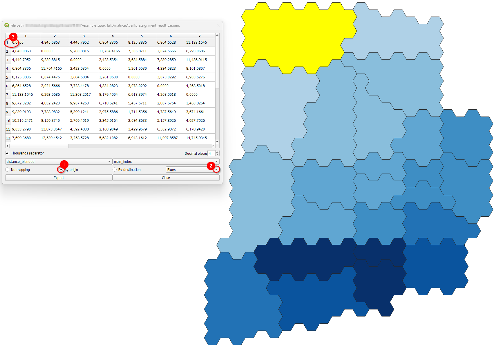

The step-by-step when selecting *By destination*, is identical to the one before. Select the
desired column (destination), notice that it will be highlighted, and the *zones* layer is
going to present a color shade according to the color palette selected. The selection of zones
for displaying is also available for destinations, and the steps are the same as presented above.

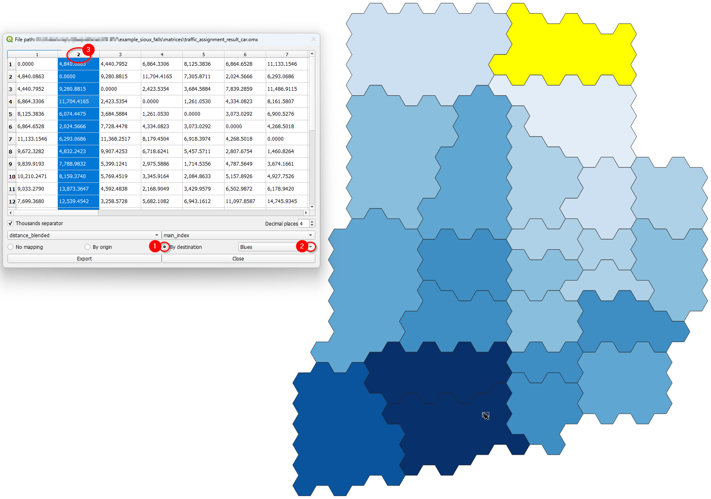

Desire Lines
------------

QAequilibraE is capable of doing two types of desire lines from a zone or a node layer:
'regular' desire lines or Delaunay lines for the demand matrix provided.

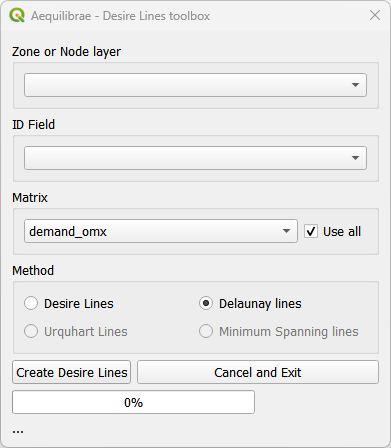

Basic workflow
~~~~~~~~~~~~~~

Let's use the Sioux Falls example and one of its default matrices. Make sure one of
'nodes' or 'zones' layer is active in the layers list.

We start selecting the input layer (1) and the field we'll use to create our desire lines
(2). We'll use 'node_id'. Then select a matrix (3). We'll use 'demand_mc', which has more
than one core, but we won't use all cores. Un-check the *"Use all"* box, and notice that
a matrix core table will open at the right-hand side of the window. Un-check the cores you
want to remove from computation (5) and click on *"Create Desire Lines"*. If you want the
usual desire lines, change the selected field in the *Method* box. 

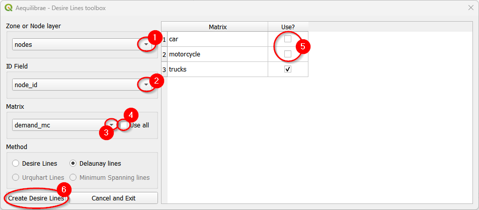

Make sure to select a zone/node layer and node ID that is compatible with your matrix.

.. subfigure:: AB
    :subcaptions: below
    :align: center

    .. image:: ../images/mapping_tools/delaunay_results.png
        :alt: Delaunay lines
    
    .. image:: ../images/mapping_tools/desire_lines_map.png
        :alt: Desire lines

.. _mapping_stacked_bandwidth:

Stacked Bandwidth
-----------------

This is a tool for plotting link flows. It uses a link layer, including Delaunay lines or desire
lines. It is also possible to choose between solid or gradient colors.

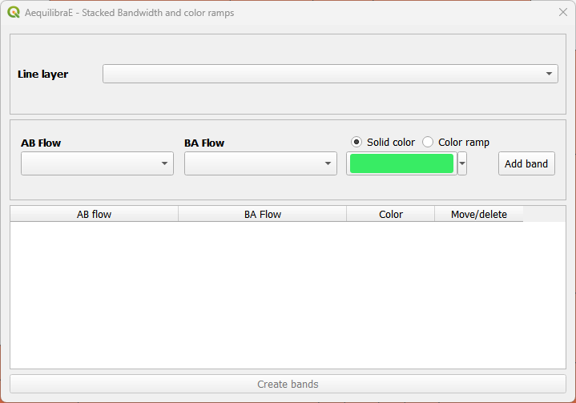

Basic workflow
~~~~~~~~~~~~~~

We'll use the traffic assignment result for Sioux Falls in this example. Don't worry if you
haven't done the assignment: you can use any other line layers and flows you want!

Before set up the bandwidth configuration, make sure you have the 'links' and 
'traffic_assignment_result' layers active in the layers list. If you open the links' layer
attribute table, you'll see that the fields of 'traffic_assignment_result' are joined.

Let's proceed with a solid band first. First, we select the line layer (1) and the AB/BA flow
variables (2 and 3). Regarding the color, you can use a random color selected by QAequilibraE 
or choose the one you want. Just click on the dropdown button at the right-hand side of the
color box. To add the band, we click on the *"Add band"* button (4). You'll notice that the
band configuration is now available at the table and the *"Create bands"* button is enabled.
Click on it (5) and the links layer in the canvas will automatically be updated.

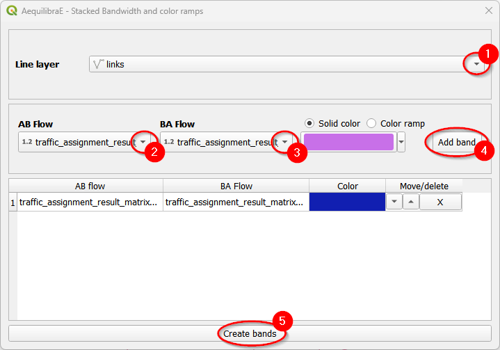

It is also possible to use color ramps instead of solid colors for plotting your data.
Select the line layer (1) and the flow variables (2 and 3). Let's select the *"Color ramp"*
option (4) and configure the ramp (5).

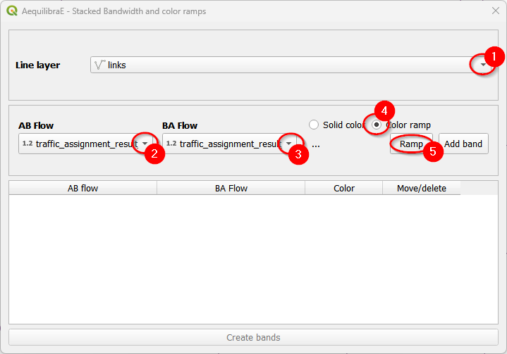

When the color ramp window opens, configure once again the fields (1) and the color ramp
you want to use. We'll use the default 'Blues' in this example. Click *"Done"* (2) when
you finished.

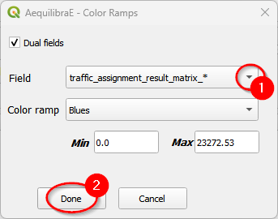

Finally, add the configured band to the project table (1) and click on the *"Create bands"*
button (2).

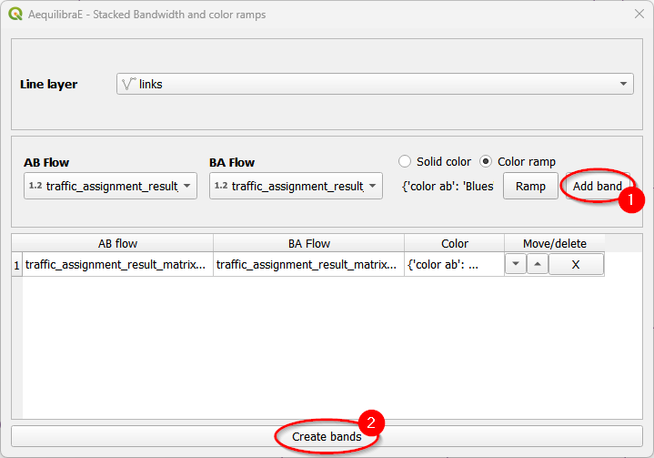

You can also control the overall look of these bands (thickness and separation between AB and
BA flows) in the project properties. Go to the properties box in the Project menu and click on
the *Variables* tab. We'll edit the ``aeq_band_width`` variable.

.. subfigure:: AB
    :align: center
    :gap: 8px

    .. image:: ../images/mapping_tools/project_properties.png
        :alt: Project menu
    
    .. image:: ../images/mapping_tools/edit_variables.png
        :alt: Edit project variables

And we're all set! You might need to refresh or pan the map for it to redraw after
changing the project variables.

.. subfigure:: AB
    :subcaptions: below
    :align: center

    .. image:: ../images/mapping_tools/stacked_bandwidth_solid_color.png
        :alt: Solid color
    
    .. image:: ../images/mapping_tools/stacked_bandwidth_color_ramp.png
        :alt: Color ramp

.. _mapping_scenario_comparison:

Scenario Comparison
-------------------
To compare scenarios, we need to have two different assignnment results (the original one
and another from forecast). If you don't know how to run a forecast, take a look at the
:ref:`trip distribution workflow <trip_distribution_workflow>`.

The scenario configuration requires the user to set AB/BA flows for the two
sets of link flows being compared, as well as the space between AB/BA flows,
and band width.

The user can also select to show a composite flow comparison, where common
flows are also shown on top of the positive and negative differences, which
gives a proper sense of how significative the differences are when compared to
the base flows.

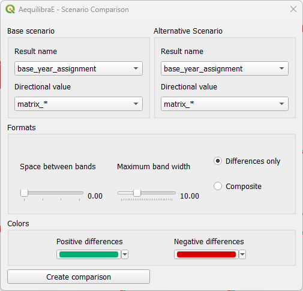

Basic workflow
~~~~~~~~~~~~~~
Create a mapping for scenario comparison is pretty straightforward: select the result
name and directional value for the base scenario (1) and repeat the process for the
alternative scenario (2). If you want, you can edit the space between bands and the
maximum band width: it all depends on how you want your results to look like. Select
your displaying method (3) - we'll use differences only, and just click on "*Create Comparison*"
(4) to run the procedure.

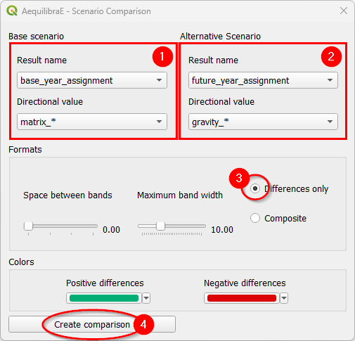

And this is what it looks like!

.. subfigure:: AB
    :subcaptions: below
    :align: center

    .. image:: ../images/mapping_tools/scenario_comparison_3.png
        :alt: Differences only
    
    .. image:: ../images/mapping_tools/scenario_comparison_4.png
        :alt: Composite lines