.. _paths_procedures:

Path Computation
================

From version 0.6, AequilibraE plugin does not require the user to create the graph to perform
path computation as in previous versions. In this version, as you set up your own configurations,
the software already computes the graph for you.

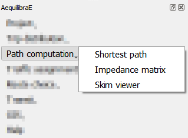

Shortest Path
-------------

The first thing we can do with a project is to compute a few arbitrary paths to see if the
network is connected and if paths make sense.

The shortest path menu consists in two complimentary windows: one for selecting the to/from
nodes and how we want to visualize the output and the other for configuring the network graph.

.. subfigure:: AB
    :subcaptions: below
    :align: center

    .. image:: ../images/path_computation/shortest_path_1.png
        :alt: Shortest path settings

    .. image:: ../images/path_computation/shortest_path_2.png
        :alt: Network graph configuration

Basic workflow
~~~~~~~~~~~~~~
We'll use Sioux Falls example in this workflow. Open the shortest path window and notice that
the only action available is to configure the network. We'll click on the "*Configure*"
button (1).

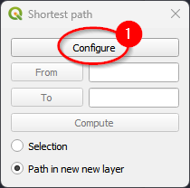

For the case of Sioux Falls, we need to configure the graph to accept paths
going through centroids (all nodes are centroids), but that is generally not the
case. For zones with a single connector per zone it is slightly faster to also
deselect this option, but use this carefully.

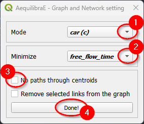

If we select that paths need to be in a separate layer, then every time you
compute a path, a new layer with a copy of the links in that path will be
created and formatted in a noticeable way. You can also select to have links
selected in the layer, but only one path can be shown at time if you do so.

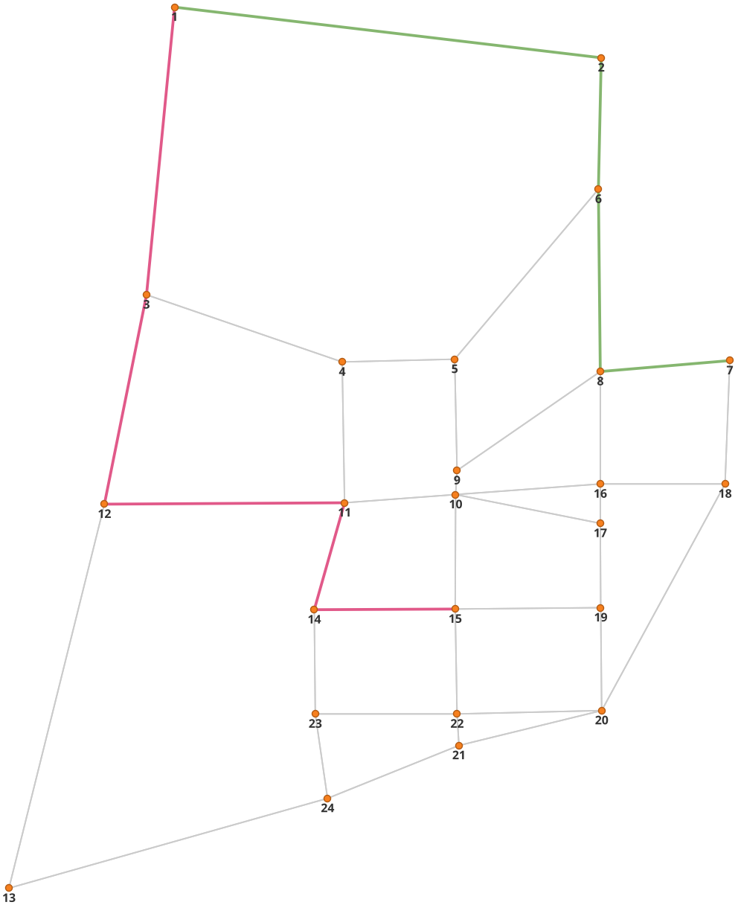

Impedance Matrix (aka Skimming Matrix)
--------------------------------------

We can also skim the network to look into general connectivity of the network.

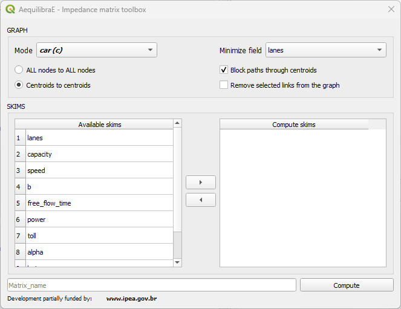

The "*Graph*" configurations at the top of the screen allow us to configure the graph:
selecting the computation of a matrix from all nodes to all nodes, or from centroids to
centroids, as well as to not allow flows through centroids. Besides chosing the mode to
skimand the minimize field for computation.

The remaining controls stand at the "*Skims*" configuration, where we select the fields
we should skim when computing the paths.

Basic workflow
~~~~~~~~~~~~~~
We'll use Sioux Falls example to compute the impedance matrix. We begin chosing the mode (1)
and the field to minimize (2). Let's compute skims for centroids to centroids (3), without
blocking flows through centroids (4) because all nodes in Sioux Falls are also centroids.

To select the skims for computation, select them at the available skims panel and click on
the arrow to add it to computation panel (steps 5 to 7). Finally, create an output name (8)
and compute the skims (9).

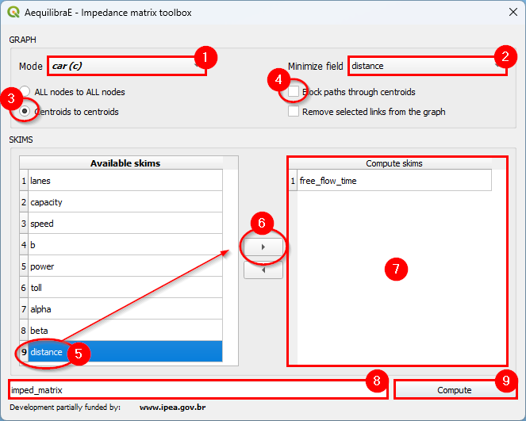

With the results computed, one can display them on the screen, loading the 
data from the *Matrix* tab, using the :ref:`Visualize data <mapping_visualize_data>` tool
in the Mapping menu.

Skim viewer
-----------

The skim viewer tool allows the user to easily visualize network costs, even for metrics
that weren't skimmed yet. The skim viewer window looks like this:

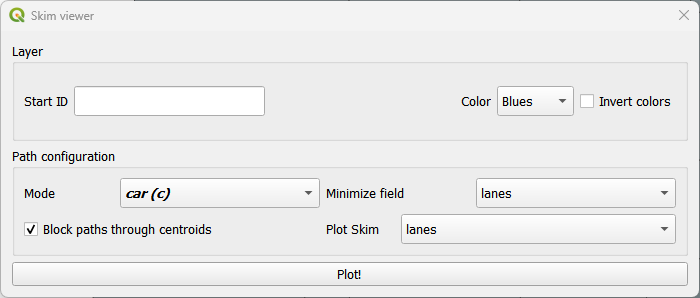

In the *Layer* group, you can select the starting node/zone ID and configure the color map range
for plotting. It is now possible for you to invert the colors in the color map, so feel free to
customize your view as necessary. By default, every time Skim Viewer is initialized, a random
value is assigned to the start ID. You can either use it or select a preferred start ID.

In the *Path configuration* group, you can set the graph configurations, such as the mode, 
the minimizing (cost) field, the choice to block or allow flows through the centroids. If the 
'links' layer is at the layers' panel, Skim Viewer allows you to use its joined fields as
minimizing or skimming fields.

To start Skim Viewer one of 'nodes' or 'zones' layer must be the active layer, otherwise an
error is raised. To configure the start node/zone ID, it is possible to use the start ID box
(pre-configured or customized) or select one feature in the active layer prior to the Skim Viewer
initialization. If a feature is selected and a value for start ID is set, Skim Viewer is going
to use the selected feature value for path calculation.

When visualizing the skims, you'll notice that a memory layer named 'skim_viewer' is created.
It contains the node/zone ID for joining the nodes or zones layer and a data column that 
holds the data to be plotted. Whenever the selected node/zone changes, the values in the data
column also change.

Skim view without joined layer
~~~~~~~~~~~~~~~~~~~~~~~~~~~~~~

For demonstration purposes, we'll use the Coquimbo model for this example. You can go directly to
the skim viewer and set the configuration, as presented below:

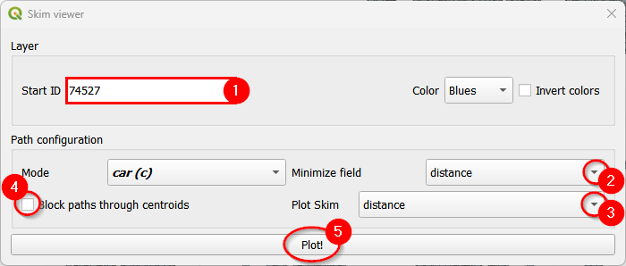

The output in the map canvas is:

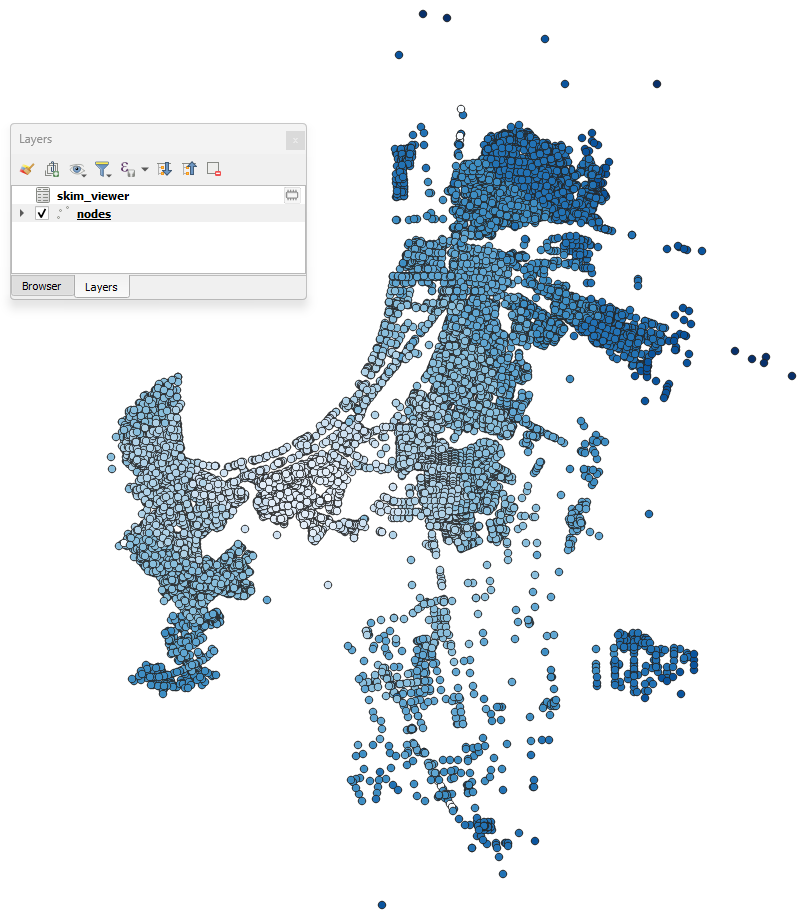

If you select any other node with the skim viewer window open in the background, you will
notice that the image displayed in the map canvas automatically changes.

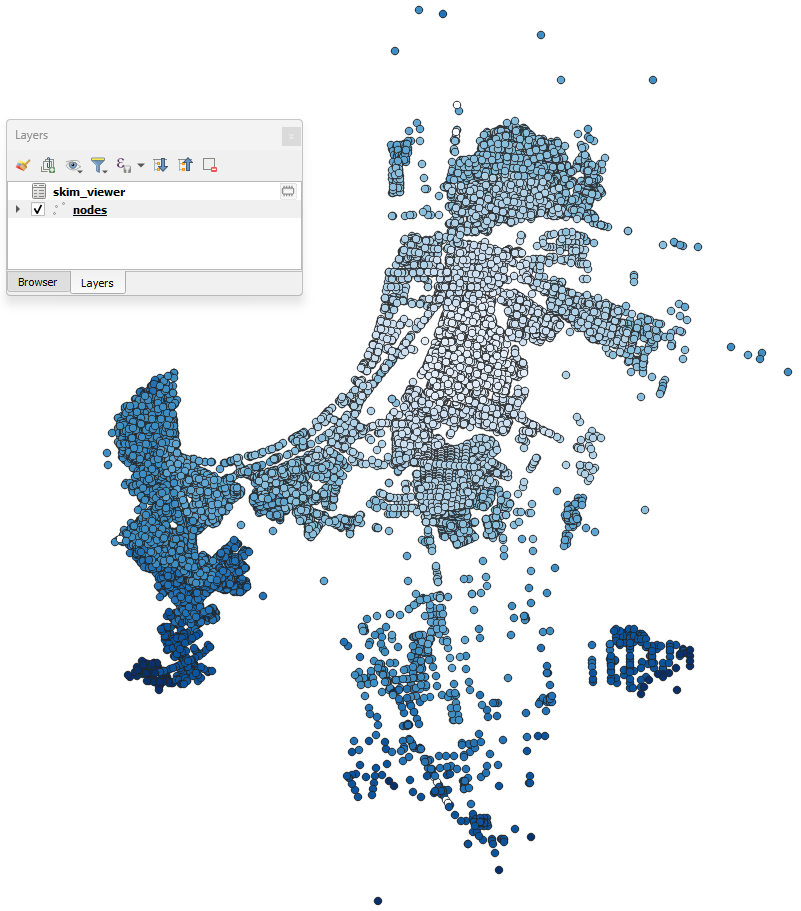

If you want to change either the minimizing field or skimming field (or both), you can modify 
your selection directly in the skim viewer window, and it will be automatically recomputed 
for display in the map canvas.

Skim viewer with joined layer
~~~~~~~~~~~~~~~~~~~~~~~~~~~~~

For this example, we'll use the Sioux Falls model. First, join the 'links'
layer with the desired results table (see :ref:`mapping_visualize_data` for more information).
Then, go to the skim viewer. When you see the window for the first time, you won't notice
anything different, but when you click on the minimize field and available skims,
you'll notice that the joined fields also appear here.

Let's plot the zones for Sioux Falls, starting at zone ID 5, and using
*traffic_assignment_result_congested_time* for both the costs and skimming fields. The initial
configuration looks like this:

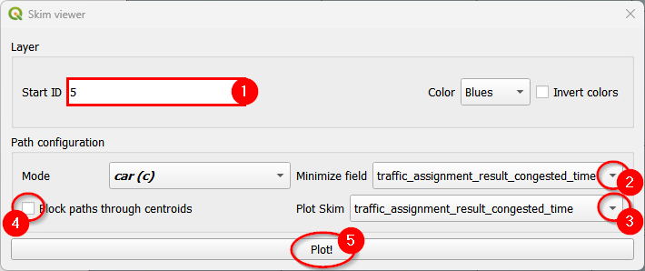

The output in the map canvas will be:

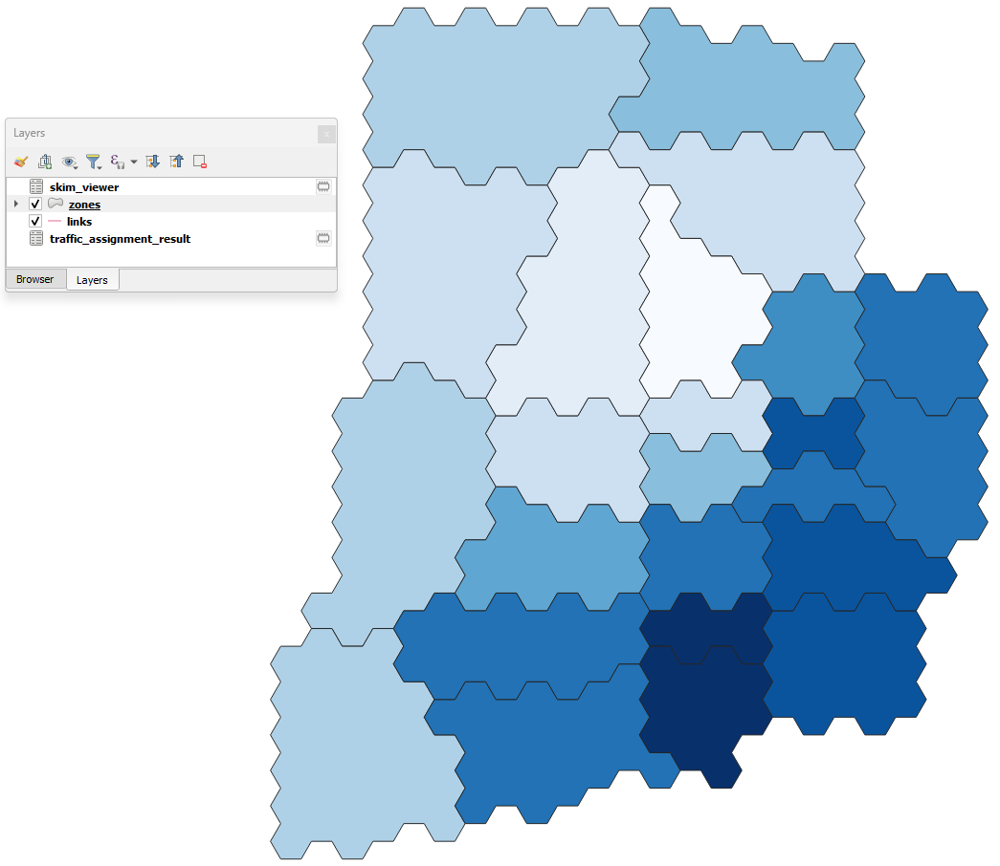

If your zone layer is active and you select another zone with the skim viewer window 
open in the background, you'll notice that the image in the map canvas automatically changes.

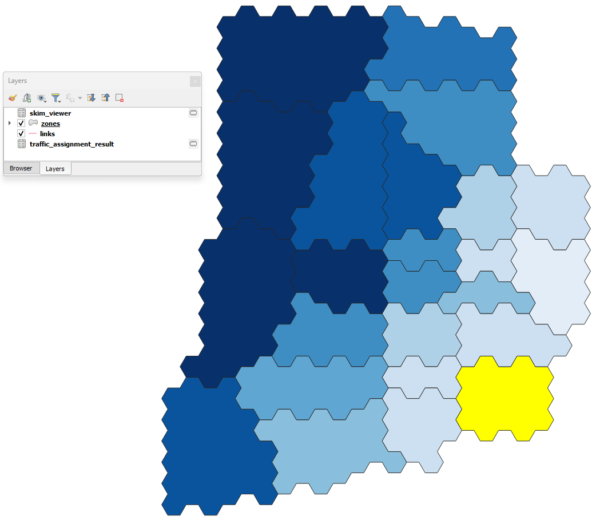

If you want to change either the minimizing field or skimming field (or both), you can modify your
selection directly in the skim viewer window, and it will be automatically recomputed
for display in the map canvas.
