Paths and Assignment
====================

From version 0.6, AequilibraE plugin does not require the user to create the graph to perform
path computation as in previous versions. In this version, as you set up your own configurations,
the software already computes the graph for you.

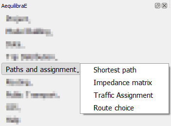

.. _siouxfalls-individual-path-computation:

Shortest Path
-------------

The first thing we can do with this project is to compute a few arbitrary paths
to see if the network is connected and if paths make sense.

Before computing a path, we go to the configuration screen.

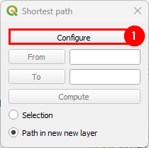

For the case of Sioux Falls, we need to configure the graph to accept paths
going through centroids (all nodes are centroids), but that is generally not the
case. For zones with a single connector per zone it is slightly faster to also
deselect this option, but use this carefully.

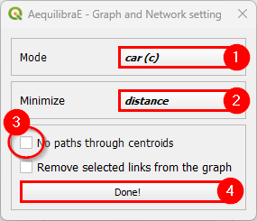

If we select that paths need to be in a separate layer, then every time you
compute a path, a new layer with a copy of the links in that path will be
created and formatted in a noticeable way. You can also select to have links
selected in the layer, but only one path can be shown at time if you do so.

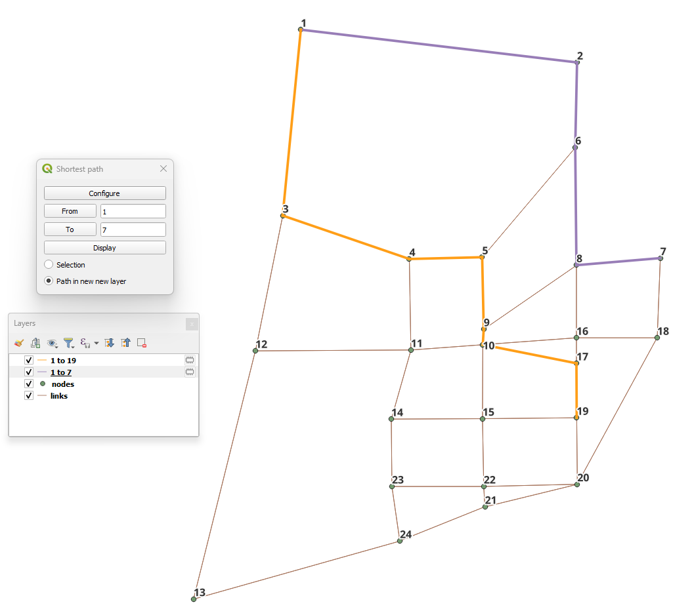

.. _siouxfalls-skimming:

Impedance Matrix (aka Skimming Matrix)
--------------------------------------

We can also skim the network to look into general connectivity of the network.

To perform skimming, we can select to compute a matrix from all nodes to all nodes,
or from centroids to centroids, as well as to not allow flows through centroids.

The main controls, however, are the mode to skim, the field we should minimize
when computing shortest paths and the fields we should skim when computing those
paths.

.. image:: ../images/performing_skimming.png
    :width: 675
    :align: center
    :alt: performing_skimming

With the results computed (AEM or OMX), one can display them on the screen, loading the 
data using the :ref:`non-project data tab <fig_nonproject_data>` in **Data > Visualize data**. 

.. _siouxfalls-traffic-assignment-and-skimming:

Traffic assignment
------------------

Having verified that the network seems to be in order, one can proceed to
perform traffic assignment, since we have a demand matrix.

The Traffic Assignment procedure tab looks like this!

.. image:: ../images/project_overview.png
    :width: 877
    :align: center
    :alt: Project overview

In the *Traffic Classes* tab you will create the traffic classes used in the project.
First, select one of the available matrices (in \*.AEM or \*.OMX format), and the matrix core
that will be used for computation. For the Sioux Falls example, we don't want to block
flow through centroids, but this is only necessary because regular nodes of the network are centroids. 
When you finish, just press the *Add Traffic class to assignment* button.

.. image:: ../images/traffic_open_matrix.png
    :width: 877
    :align: center
    :alt: Calling assignment

To select skims, we need to choose which fields/modes we will skim

.. image:: ../images/skim_field_selection.png
    :width: 877
    :align: center
    :alt: Skim selection

And if we want the skim for the last iteration (like we would for time) or if we
want it averaged out for all iterations (properly averaged, that is).

.. image:: ../images/skim_blended_versus_final.png
    :width: 877
    :align: center
    :alt: Skim iterations

Next, we can choose to run a select link analysis. Its default configuration is not
to select any links, so we have to toggle its *"Set select link analysis"* button.

.. image:: ../images/select_link_1.png
    :width: 898
    :align: center
    :alt: Select link analysis 1

The creation of queries for analysis consists in: create a name for the query,
select the travel direction, add the link ID, and click on *Add to query*, to temporarily
save the data to the query.

.. image:: ../images/select_link_2.png
    :width: 898
    :align: center
    :alt: Select link analysis 2

Adding more links to the previous query is straightforward. Select the direction
and the link ID, and press *Add to query* once again.

.. image:: ../images/select_link_3.png
    :width: 898
    :align: center
    :alt: Select link analysis 3

When we are done with the current query, we click on *Save query*, and notice that
the query with the selected links is going to appear in the right-hand side table.

.. image:: ../images/select_link_4.png
    :width: 898
    :align: center
    :alt: Select link analysis 4

To finish the select link analysis step, we choose one name to save one or both of
the matrix and results files.

.. image:: ../images/select_link_5.png
    :width: 898
    :align: center
    :alt: Select link analysis 5

The final step is to setup the assignment itself.

Here we select the fields for:

* link capacity
* link free flow travel time
* BPR's *alpha*
* BPR's *beta*

We also confirm the Relative gap and maximum number of iterations we want, the
assignment algorithm and the output folder. In this case, we again choose to not
block flows through centroids for the reason discussed above.

.. image:: ../images/setup_assignment.png
    :width: 898
    :align: center
    :alt: Setup assignment

.. _usage-of-results-layer-join:

The result of the traffic assignment we just performed is stored in the results.sqlite
database within the project folder. It can be easily accessed and loaded by clicking
**Data > Visualize data**, and a project data window will open. Just click on the
*Results* tab, select the desired result, let the *Join with layer* option checked,
and click in the *Load Result table as data layer* button at the bottom. The result table
layer will be automatically joined with the links layer.

.. image:: ../images/data_visualize_data_results-v2.png
    :align: center
    :alt: add_layer

Now we can revisit the instructions for :ref:`siouxfalls-stacked-bandwidth`

Route choice
------------

With the route choice sub-module, it is possible to create choice sets with three different algorithms
as well as assign trips to the network using the traditional path-size logit. Using this module in QAequilibraE is trivial

In the tab "Route choice model", we add the model configuration. It consists of
three different boxes. In the first box "*Choice set generation*", we input parameters for 
the choice set construction. In the "*Route choice model"*, we add the parameters for the route 
choice model, such as the utility function and the path overlap parameter (PSL/beta) value. Finally, in 
"*Graph configuration*" we set up the graph used for computation.

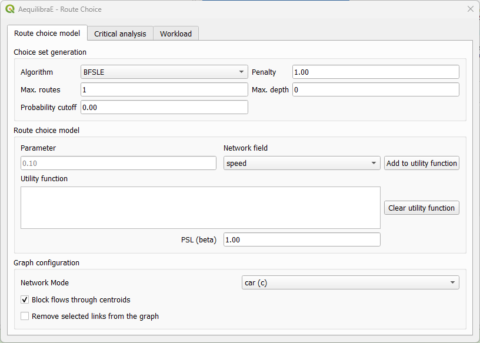

In the tab "Critical analysis", we can select to run either a set of select link analysis or a sub-area 
analysis. These analyses cannot be run at the same time in QAequilibraE. If you choose to run a sub-area 
analysis, all OD pairs with demand are considered for computation. To select only a few pairs
of interest, we encourage you to take a look at 
`Route choice with sub-area analysis <https://www.aequilibrae.com/develop/python/route_choice/_auto_examples/plot_subarea_analysis.html>`_ 
at AequilibraE's Python documentation and run this task outside QGIS.

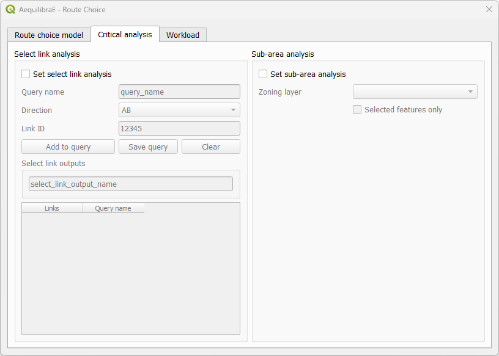

Lastly, the tab "Workload" allows users to choose between three tasks. The first box, "*Execute single*"
consists of computing route choices between two different nodes and visualizing it, while the
second box "*Matrix*" allows the selection of a travel demand matrix to be assigned using the route choice specified.
This option also allows the user to save choice sets to disk while performing route choice.

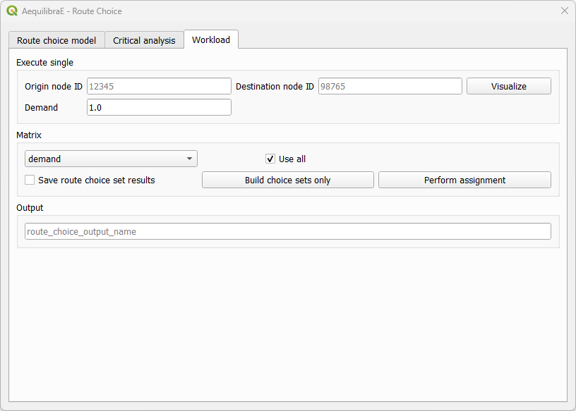

We can run different workflows with the route choice sub-model. We'll briefly present them.

Basic route choice
~~~~~~~~~~~~~~~~~~

In this example, we'll perform route choice for the Coquimbo example model for a single OD pair. 
As this example model does not ship with a demand matrix, we can manually create an open layer and 
use its data to import the matrix to the project, as shown in :ref:`importing_matrices`.

.. _basic_route_choice_setting:

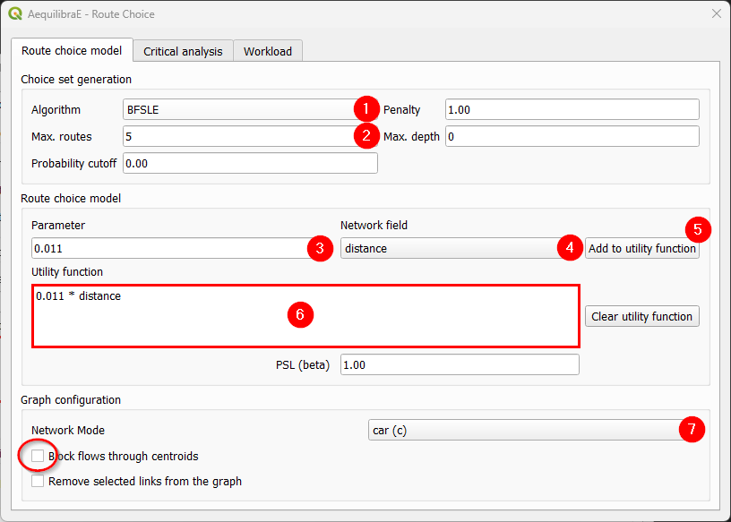

We start by setting the route choice parameters. In the "Choice set generation" box, we select the algorithm
to be one of Link Penalization (LP), Breadth-First Link Search on Link Elimination (BFSLE), or BFSLE with LP, 
choose the values for probability cutoff and penalty, and choose a positive value for one of maximum number 
of routes (LP) or search depth (BFSLE and BFSLE + LP).

In the box "Route choice model" box, we configure our utility function. In this example, it is a
function of distance, but could be any other numeric field, such as travel time or tolls.
We then add the parameters to the utility function and it will appear in the utility function box. We can
change the utility function by cleaning it and adding it one more time. To add more parameters to the
utility function, just change the values and click in "Add to utility function" one more time.

Regarding "Graph configuration", we'll use the network for cars and allow flows through centroids.

We can now move directly to the "Workload", select origin and destination nodes and click on the *visualize* button.

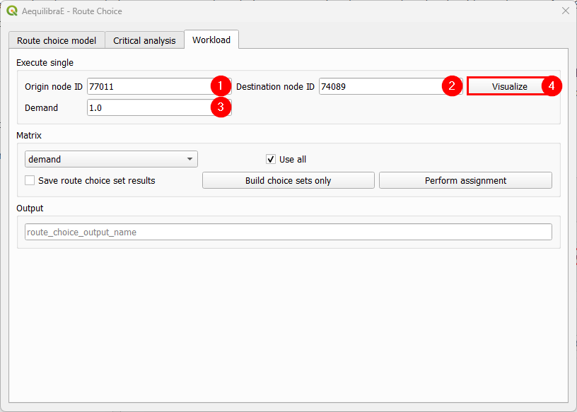

A new window named Execute Single will appear, loading the configuration we just used for the route
choice set. If we are done with the choice set generation, we can close it, otherwise, we can
generate the route choice set for another OD pair, also setting the desired number of routes.

.. subfigure:: AB
    :align: center

    .. image:: ../images/route_choice_6_1.png
        :alt: Basic route choice - execute single dialog - first OD pair

    .. image:: ../images/route_choice_6_2.png
        :alt: Basic route choice - execute single dialog - new OD pair

After a few seconds, the output visualization for the routes is shown in the map canvas and we
can close the Execute Single window. The figure below presents the route choice sets, in which
the line width corresponds to the probability of choosing each link.

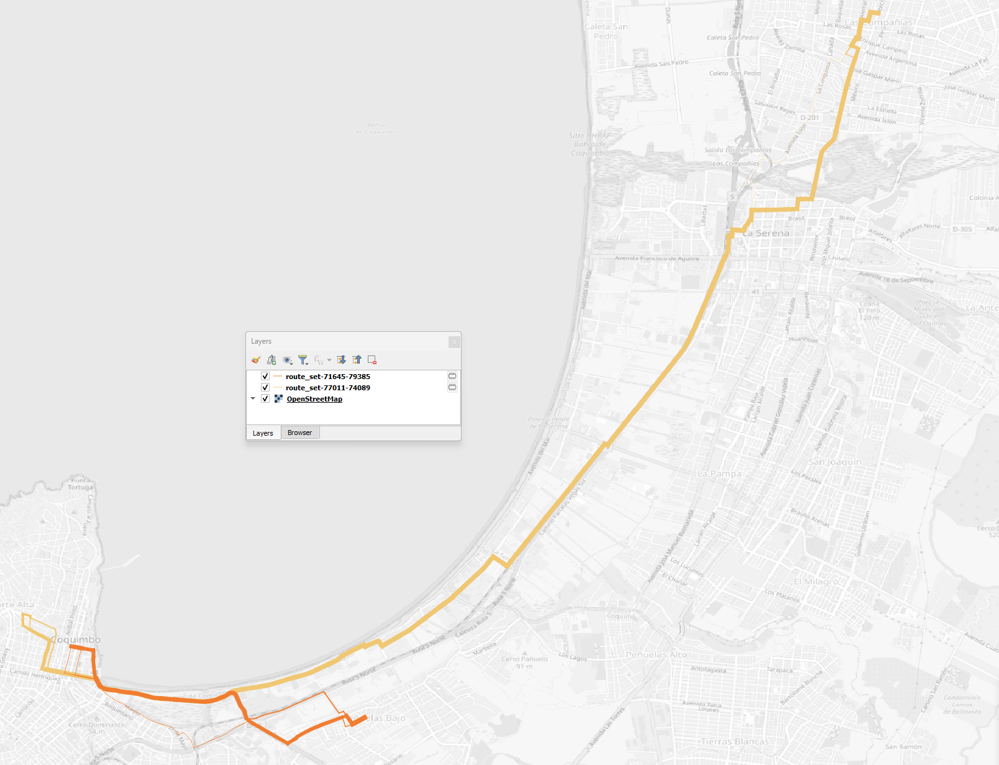

Build choice sets
~~~~~~~~~~~~~~~~~

Within this workflow, we can build and save the choice sets without performing assignment.
We start by :ref:`configuring the model parameters <basic_route_choice_setting>`, then go
to the "Workload" tab and select our demand matrix and its cores for computation.

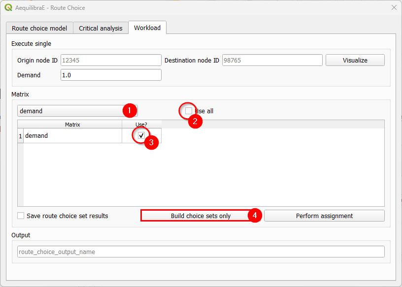

If you want to use all cores for computation, just let the "Use all" checkbox untoggled after
choosing the matrix. Otherwise a table with the matrix cores and if they should be used is 
opened and we can select the cores we want.

Then all we need to do is hit the "Build choice sets only". Once the task is finished, our
route choice window will automatically close. If you go to the project folder, you will
notice that a folder named '*route choice*' containing folders with the choice sets for each 
centroid (index) in the matrix was created.

It should be noted that, although we are not performing assignment in this workflow, we
use demand matrices to determine the OD pairs for which choice sets are needed, which are all 
of those with positive demand.

Perform assignment
~~~~~~~~~~~~~~~~~~

This workflow runs a route choice assignment and allows the user to save the choice
set generated while performing such. The set up is quite similar to the one above: After 
:ref:`setting the model parameters up <basic_route_choice_setting>`, we go straight to the
"Workload" tab and select the demand matrix and its cores for computation.

In this example, we choose to also save the choice sets generated, by toggling the 
"Save route choice set results" button. If we leave this button untoggled, only link flows 
are saved into the results database.

We also choose a name for saving the results in the database. Pick up a name that you can
easily find later. Then, just hit the button "Perform assignment" and wait until the window
is closed and the process is finished.

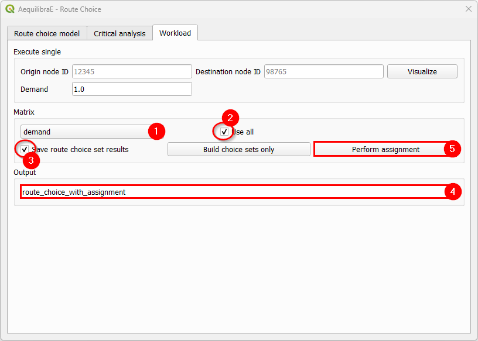

Select link analysis
~~~~~~~~~~~~~~~~~~~~~

The left portion of the "Critical analysis" tab gives the user access to select link analysis.
Its interface is quite similar to the one in Traffic Assignment, in which we can add and
remove queries with selected links, and save both the matrix and the results in the databse.

We start by toggling the "Set select link analysis" checkbox and enabling the following menus.

Let's add our first query. Create a name, set the link direction, add the link ID, and click
on "Add to query".

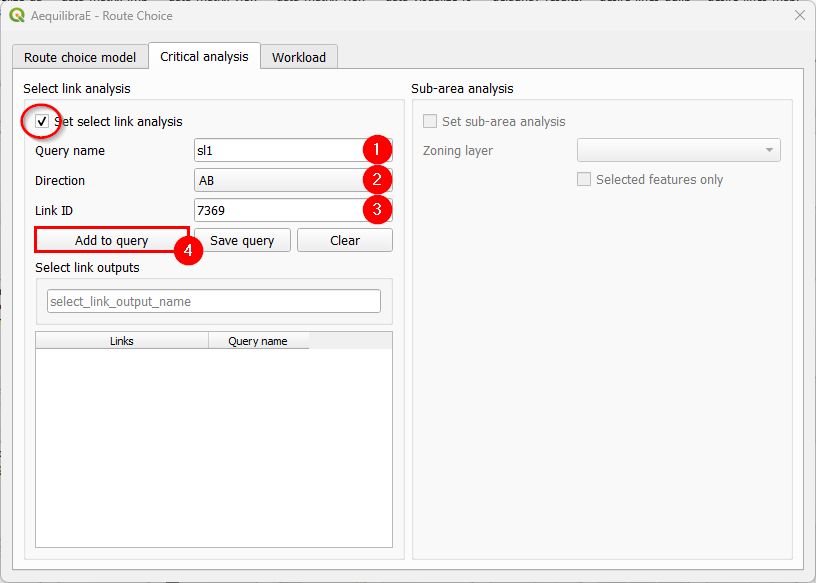

Let's add another link to our *SL1* query. Let's set the link direction and link ID, add
to the existing query with "Add to query", and click on "Save query" (4). The *SL1* query
will immediately appear in the table at the bottom of the window (5).

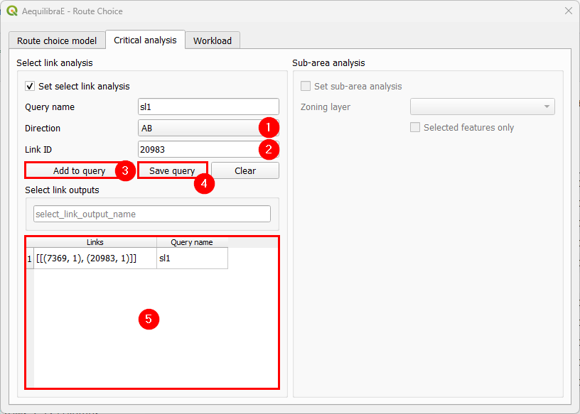

Just to make this example more interesting, let's create an *SL2* query. We repeat the process
of creating a query name, setting the direction, selecting link ID, adding and saving the query.
It will also appear at the bottom table (6). To remove any query from the query table, we can
double-click the cell. Once this is our last query, we pick up a nice name to save our select
link analysis results (7).

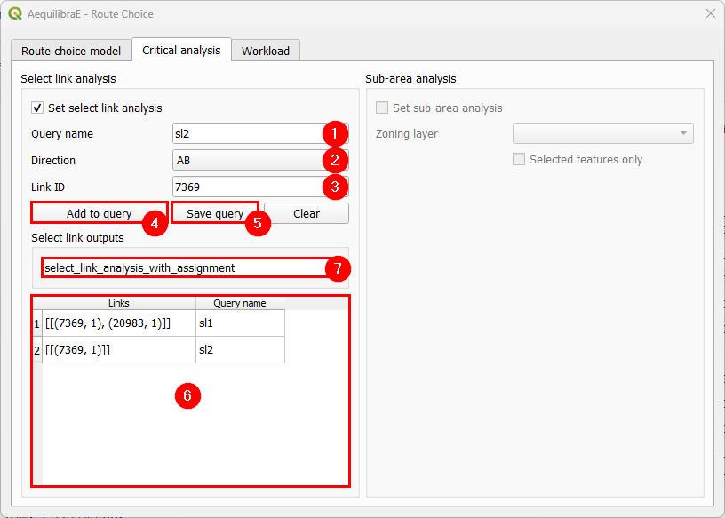

The last step consists in selecting the matrix and its cores for computation, and perform the
assignment. It's not necessary to add a name to the route choice output, once we did it in the
previous step.

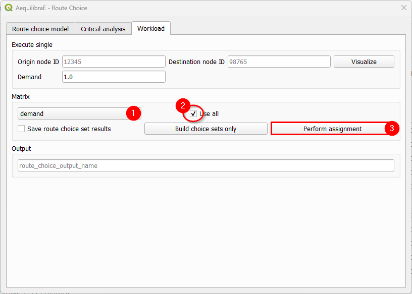

Sub-area analysis
~~~~~~~~~~~~~~~~~
To perform a sub-area analysis, we start by toggling the "Set sub-area analysis" checkbox, 
which enables us to choose a polygon layer that defines the sub-area of interest. In this example, 
we select a couple zones in Coquimbo, and toggle the
checkbox "Selected features only". We could also use an external polygon layer with the desired
region and use all the layer features rather than a part of it.

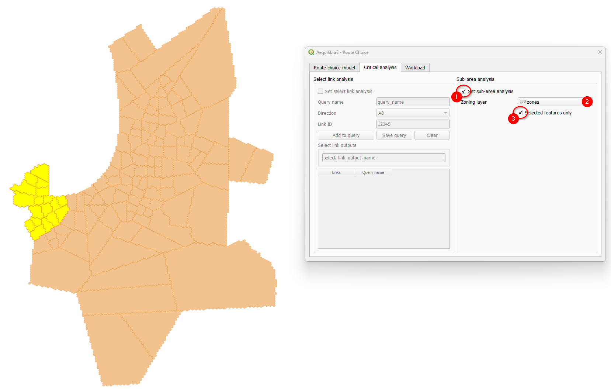

Finally, select all cores of our demand matrix for computation, don't forget to add a name for 
the output file, and hit the "Perform assignment" button. When the process is finished, the 
window is closed. If you go to the project folder, you will notice that a folder named 
'*route choice*' containing a ``.parquet`` file with the same output name you selected in (3) 
containing the sub-area demand matrix.

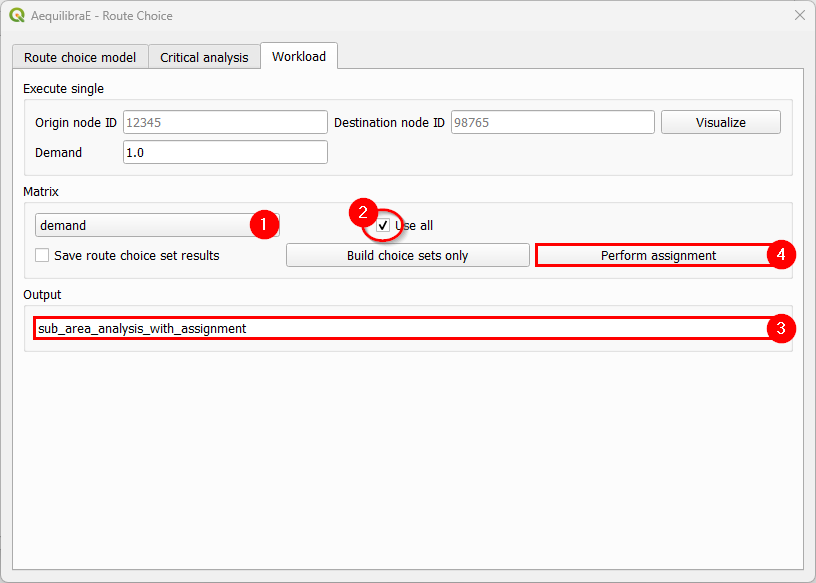

.. tip::

    Try to reproduce AequilibraE's Route Choice 
    `examples <https://www.aequilibrae.com/latest/python/route_choice/_auto_examples/index.html>`_ 
    in QGIS!