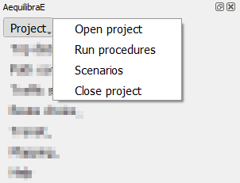
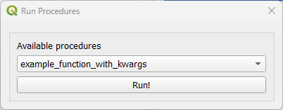
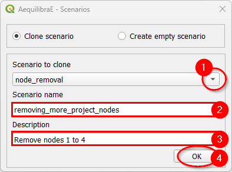
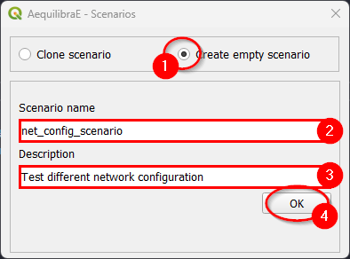
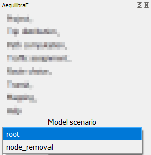

.. _aequilibrae_project:

AequilibraE Project
===================

This page is dedicated to a practical implementation of the AequilibraE project. In case you
are interested in better understanding its structure, please visit its 
`documentation <https://www.aequilibrae.com/latest/python/modeling_with_aequilibrae/project.html>`_
webpage.

Under the project menu, there are some options to choose from and the following sections
explore some of these actions.

.. _open_and_close_project:

Open & Close project
--------------------

These options are pretty straightforward and are used either to open or close a
project. You just have to click **Project > Open project** to open
a project, and **Project > Close project** to close it.

Keep in mind that to open another project or to create a new one, you **must**
close the currently open project, otherwise AequilibraE is going to return an
error.

.. _run_procedures:

Run procedures
--------------

The run procedures allows you to define model entry points and their default arguments, and run models
to the model itself. Usage at QAequilibraE is pretty straightforward: select one of the available
functions, click on the *Run!* button, and wait for the log file to open with the output results of
the model.

To better understand the application of the run module, we encourage you to read about it at 
`the AequilibraE documentation <https://www.aequilibrae.com/develop/python/run_module.html>`_.

Scenarios
---------

QAequilibraE now presents a scenario system, in which you can manage multiple scenario variants
within a single project. 

When a project is created, its default scenario is 'root'. QAequilibraE allows you to clone a
scenario or create an empty scenario. To clone a scenario, you first choose the base scenario
to clone (1) and the name of the scenario (2). An useful scenario description can also be
added at the 'Description' box (3). By default, the scenario to clone is the currently active
scenario, but you can choose anyone. To clone the scenario, just click on the 'OK' button
at the bottom of the screen (4).

To create an empty scenario, choose the 'Empty scenario' option (1), and set the scenario name
(2) and description (3). To create an empty scenario, just click on the 'OK' button at the
bottom of the screen (4).

A list containing all project scenarios is presented at the bottom of the widget screen, and
it can be used to change the currently open scenario. When changing the scenario, all geometric
layers available at the "Geo layers" tab also change.

