Public Transport
================

QAequilibraE is capable of importing a General Transit Feed Specification (GTFS) feed 
into its public transport database. 

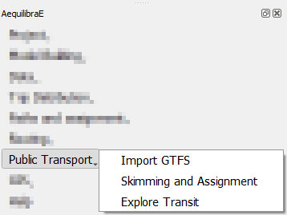

More details on the **public_transport.sqlite** are discussed on a 
*per-table* basis in `AequilibraE's documentation <https://www.aequilibrae.com/latest/python/modeling_with_aequilibrae/transit_database/data_model/datamodel.html>`_, 
and we recommend understanding the role of each table before 
setting an AequilibraE model you intend to use. If you don't know much about GTFS, we strongly encourage you to take
a look at the documentation provided by `Mobility Data <https://gtfs.org/documentation/schedule/reference/>`_.

Import GTFS
-----------

To import a GTFS feed, click **Public transport > Import GTFS**. A new window with the importer
will open. If it is the first time you are creating a GTFS feed for your project, it may take a little while
to create the public transport database in the project folder, and your QGIS screen might not be responsive 
until the database is created in the project folder. In the GTFS importer window, you can click on
*Add Feed* and point to the location in your machine where the GTFS data is.

.. image:: ../images/gtfs_1.png
    :align: center
    :alt: gtfs importer

Once the feed is loaded, you can select the service date, the agency name, and write a description for it.
It is also possible to add and/or modify the route capacities. When you're done, just click on **Add to importer**
and you will return to the GTFS importer screen.

.. subfigure:: AB
    :align: center
    :gap: 3mm

    .. image:: ../images/gtfs_2.png
        :alt: basic settings

    .. image:: ../images/gtfs_3.png
        :alt: route capacities

Notice that the feed information is now available at the *Feeds to import* table view. The first time you create a 
GTFS feed, the only option available is **Create new route system**, so you don't have to click on it.
If you want to map-match the existing transit routes, you can select **Allow map-match**.
Then, you can import your GTFS feed to your project by clicking on **Execute Importer**. 

A window with a progress bar will open and once it is finished, you can check out the GTFS feed data you just 
imported in your project folder.

.. image:: ../images/gtfs_4.png
    :align: center
    :alt: gtfs loaded

In case you want to add or rewrite information on your public transport database, you can click on
**Public Transport > Import GTFS**. You will notice a difference in the clickable buttons at
the bottom of the page, and it is now possible to **Overwrite routes** or **Add to Existing Routes**.
For any of these options, you follow the same steps previously presented to add feed data and load it into the
project.

.. image:: ../images/gtfs_5.png
    :align: center
    :alt: gtfs already exists

Transit skimming and assignment
-------------------------------

QAequilibraE incorporates two of AequilibraE's transit features: skimming and 
assignment. In this section, we'll replicate AequilibraE's Python examples and show you how to add
a new Period to your transit model. To open the menu, click on **Public Transport > Skimming and Assignment**.

The Transit skimming and assignment module consists in four different tabs. "*Periods*" is the 
first tab and it displays a visualization of the periods in the project. It also has a clickable 
button for you to add a custom period as desired. Notice that, a period representing all day-long 
(``period_id == 1``) exists by default.

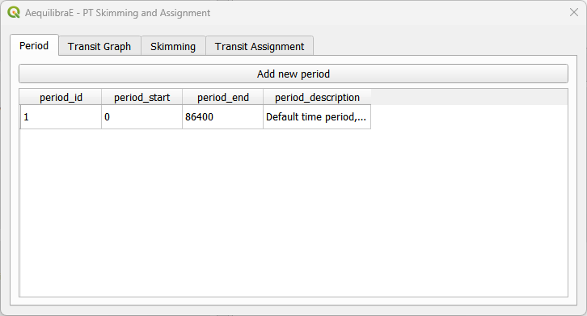

The second tab is "*Transit Graph*", in which you will add the configuration of the graph that will
be created. The four checkboxes at the top of the tab indicate some characteristics of the network
and you can select all that apply. The three drop-down buttons configure, respectively, the connector
method (which creates the connector edges between each stops and ODs), the line geometry method 
(which creates a LineString for each edge), and the match graph for mode. The last checkbox indicates
weather you want to save the assignment result in the database or not.

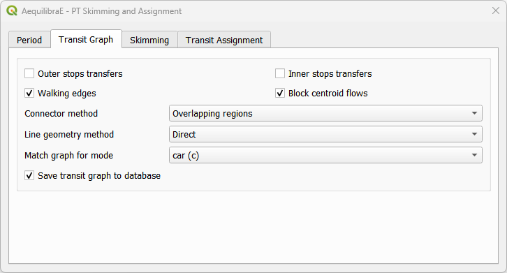

In the "*Skimming*" tab it is possible to select the fields we want to create skims for, perform
the actual skimming , and save the result as an \*.OMX file.

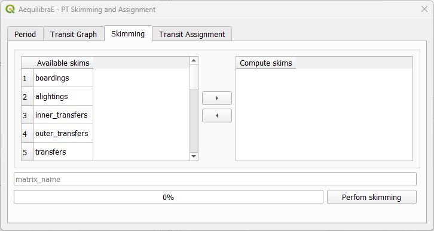

Finally, in the "*Transit Assignment*" tab, we select the demand matrix and its core that will be
set for computation, the name of the assignment class, the fields corrresponding to the travel time
and frequency, and the name we want to save the results table.

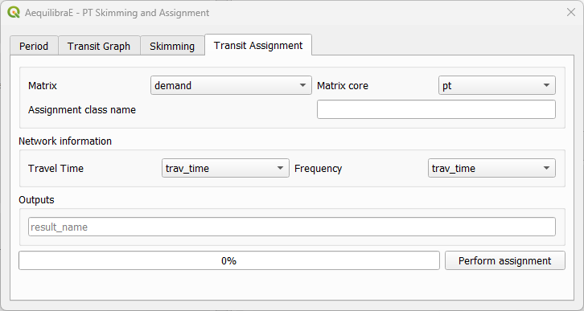

In the next sub-sections, we'll present two different workflows, one performing skimming with a
custom period and the other performing assignment for the period of one day.

Skimming with custom period
~~~~~~~~~~~~~~~~~~~~~~~~~~~

In this example we'll create a custom period and its related skimming. We start at the tab "*Periods*"
clicking on the *Add new period* button. 

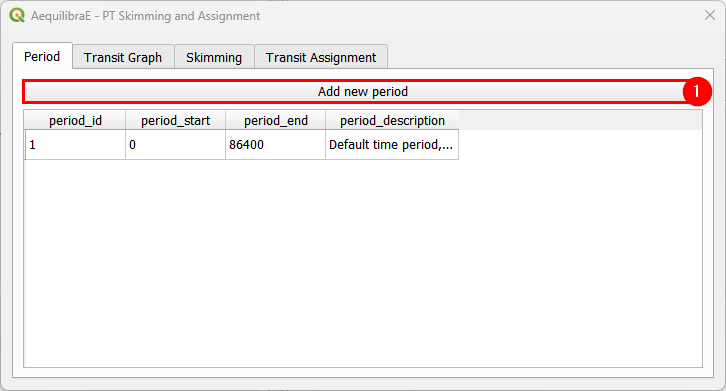

A new window containing the fields period start, end, and description will open. Add the appropriate
time and description and hit the *Add period* button at the bottom.

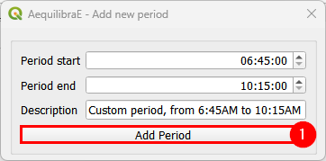

The window will close and the period will be automatically shown in the Periods table view. By default,
the periods are numbered in an ascending order based on the number of the last period added. Notice that
the start/end periods we added before are displayed as seconds at the table. Before continuing, select
the desired period by clicking on it, otherwise an error will be thrown when skimming/assigning.

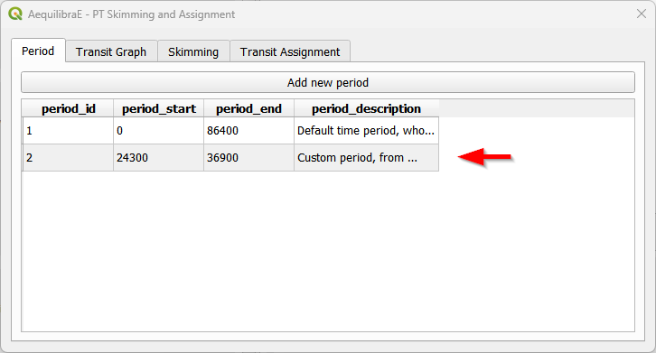

At the tab "*Transit Graph*", we'll set up the configurations of the graph. For this example, we'll
uncheck the boxes for "walking edges", "block centroid flows", and "save transit graph to database".
We can let the other settings with their default values. As Coquimbo doesn't have many walking edges,
we'll match the graph for cars.

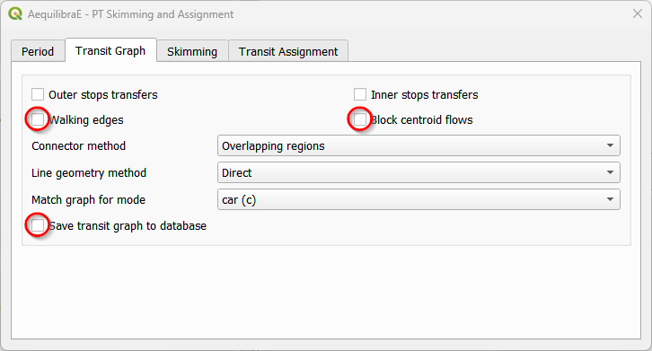

Moving to the "*Skimming*" tab, we can select the skims we want to compute, as well as select a name 
to our matrices file. To add a skim to computation, we select the fields one by one at the 
"Available skims" column and add them to the "Compute skims" column by clicking on the right-arrow
button (see steps 1, 2, and 3). Let's create a name for our output (step 4) and click on the
*Perform skimming* button. It will perform the skimming for a unit matrix, and store the result at
the project matrices' folder.

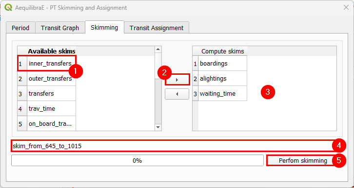

When the process is finished, the PT Skimming and Assignment window will automatically close and
you can check the outputs at the matrices folder.

Transit assignment
~~~~~~~~~~~~~~~~~~

In this example, we'll perform the assignment for all day-long also for Coquimbo. This is a reproduction
of an AequilibraE's `example <https://www.aequilibrae.com/develop/python/_auto_examples/public_transport/plot_public_transit_assignment.html#>`_.

Let's start the example selecting the default period at the periods table.

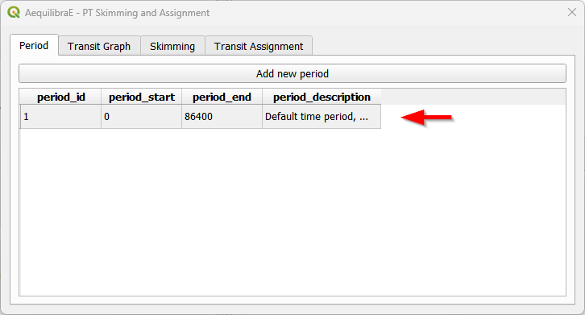

Now let's configure our transit graph. We'll uncheck the buttons "walking edges" and "block centroid flows",
however, we'll save the transit graph in the database, just in case we want to re-use it in another project.
We set the "line geometry method" as "*Connector project match*" because project graphs must be build with
this method.

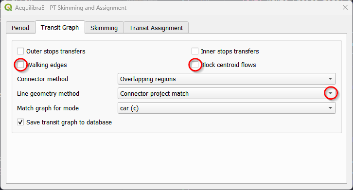

As we're running an assignment, we'll skip the Skimming tab and move directly to "*Transit Assignment*".
Let's select a demand matrix and its core for computation (steps 1 and 2). As Coquimbo doesn't have any 
matrix in its matrices folder, you'll have to create one open layer and 
:ref:`import it to the project <importing_matrices>`. Then, select an appropriate  name for the transit 
assignment class (setp 3), and the variables that corresponds to the travel time and frequency (steps 4 
and 5). Lastly, select an appropriate name for the output that will be stored in the results database 
(step 6) and just hit the *Perform Assignment* button at the bottom.

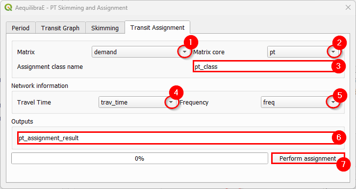

Explore transit network
-----------------------

Case you have already imported a GTFS feed into your project or you want to open a feed from an AequilibraE project 
created with Python, you can click on **Public Transport > Explore Transit** to visualize the Transit 
routes. While opening the Transit Navigator, you will notice that the layers *patterns*, *routes*, *stops* and
*zones* from the GTFS file are going to be displayed in your map canva, and appear in the layers list.

.. image:: ../images/gtfs_7.png
    :align: center
    :alt: gtfs display layers

The navigator window has five different tabs you can explore.

.. image:: ../images/gtfs_6.png
    :align: center
    :alt: gtfs transit explorer

In the top, there are the three boxes one can select and
filter routes, patterns, and stops. You will notice that whenever an element is selected or filtered, this selection
is automatically displayed in the map canva. After filtering data, if you want to restore the original layers,
you can click on **Minor reset**, and your layers are restored.

In the *Global filtering* tab, it is possible to filter your GTFS by *Agency*, *GTFS type*, *Time window*, and 
*directions*. It is also possible to select a sample from the GTFS data to analyze. The fitering performed in this
tab is automatically displayed in the map canva. To restore the original layers, just click on **Reset**.

In the last three tabs, one can display useful information about stops, routes, patterns, and zones. For instance, you 
can find out *how many routes stop at a specific stop location*, *what is the total capacity of a specific route*, 
or *which zones have more stops or routes across them*. Within these tabs, it is possible to configure how one wants to 
display the information, by selecting the object color, or thickness (size). It is also possible to display labels, by
selecting the **Show labels** option. The figures below show the number of routes across the stops displaying the
information with different symbol colors and sizes. Notice that in the layers list, the variable scale for number of
routes is shown, as well as a data layer named *stops_metrics*, which contains the available metrics for the existing
stops.

.. image:: ../images/gtfs_8.png
    :align: center
    :alt: gtfs view by color

|

.. image:: ../images/gtfs_9.png
    :align: center
    :alt: gtfs view by thickness