.. _traffic_assignment_procedures:

Traffic assignment
==================

Having verified that the network seems to be in order, one can proceed to
perform traffic assignment, since we have a demand matrix.

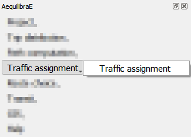

The Traffic Assignment window currently has five tabs. The first one is the *Project* tab
where you can check the project path and the available modes. In the *Project* tab it is
also possible to load configuration from a YAML file.

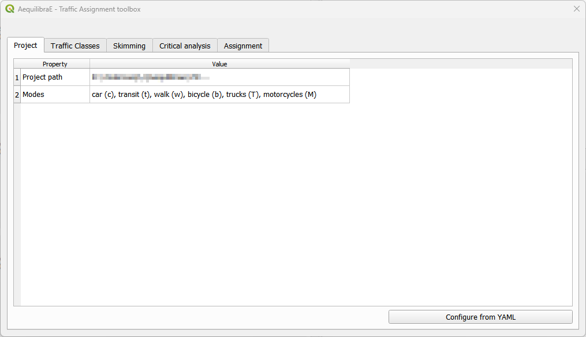

In the *Traffic Classes* tab you will create the traffic classes and graphs used in the project.
This is where one of the available matrices and its core for computation are selected. We can 
modify the passenger car equivalent (PCE) for whatever value applies in your analysis, as well
as include the value of time (VOT) as fixed cost. It is also possible to remove links from the
analysis by selecting them before opening the Traffic Assignment window, and toggling the button
*Remove selected links from the graph*. More about 
`graph configuration <https://www.aequilibrae.com/develop/python/path_computation/aequilibrae_graph.html>`_
can be found in the AequilibraE documentation.

.. important::

    For setting a fixed cost, one **must** have a value fot the *vot* column in the project
    *modes* table.

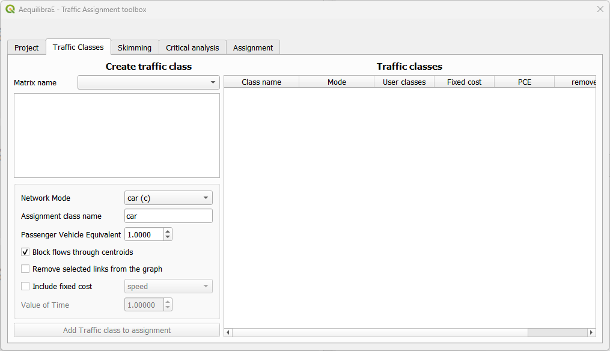

In the *Skimming* tab it is possible to select the skimming fields for each traffic class, and
the results desired: final or blended. Final stands for the result of the last iteration, while
blended represents the averaged results for all iterations. Just check the desired boxes.
Notice that the Class field only is populated if the traffic classes were properly set in the
previous step.

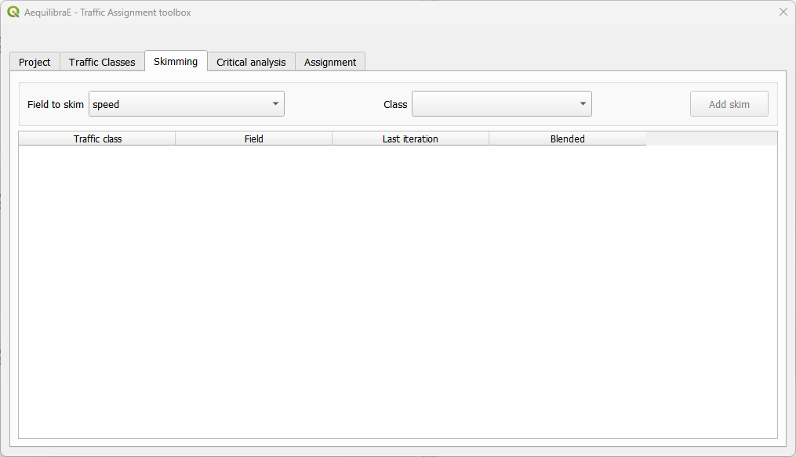

The *Critical analysis* tab allows running a select link analysis with the traffic assignment.
QAequilibraE default configuration is NOT running this analysis, so you have to toggle its
button to 'activate' the configuration interface. There, it is possible to set up a query name,
a travel direction, and the link ID. Adding and removing links from queries, and modifying queries
should be straightforward. Saving the output matrices and results for select link analysis
are also configured here.

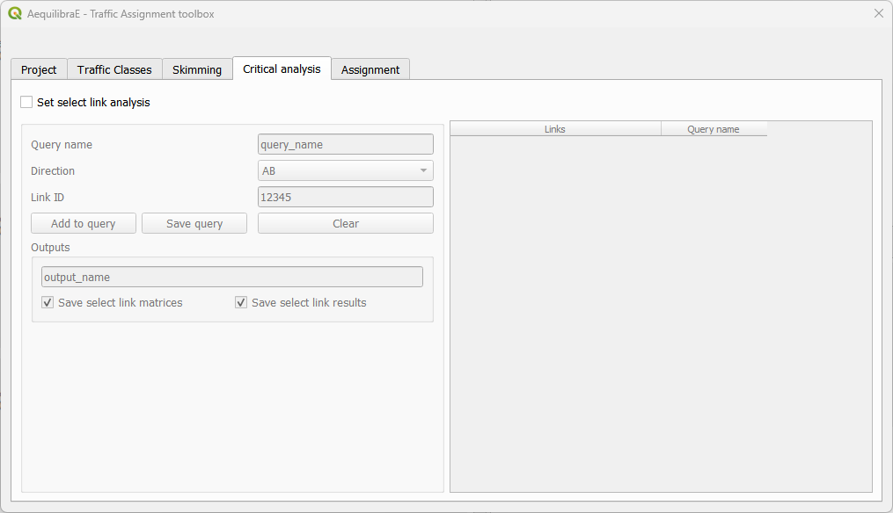

In the *Assignment* tab we select the assignment algorithm and configure the volume-delay
function and its *alpha* and *beta* parameters. The fields for link capacity and free flow
travel time are selected. We also confirm the relative gap and maximum number of iterations
we want, and the output folder. Now it is possible to save your project configurations in
either one Python or YAML file. While the Python file is stored inside the project run folder
to be executed as part of 'Run procedures', the YAML file can be used as input for other
model runs, as input in the *Project* tab.

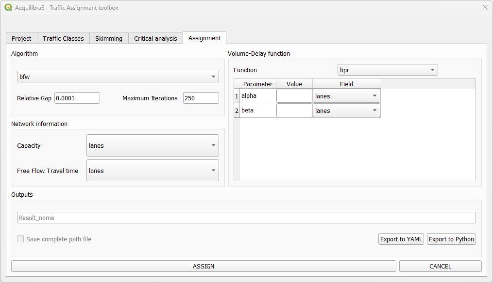

.. _traffic_assignment_workflow:

Basic workflow
--------------

Let's run a traffic assignment for Sioux Falls. You don't have to worry with demand matrices:
we'll use one of the matrices already available in the model.

We start selecting one of the available matrices and the matrix core that will be used for
computation. We must click on the matrix core to select it (2), otherwise the traffic class
creation will fail. As this is a single class traffic assignment, we'll use the default
configurations for network mode and assignment class name (3 and 4). For the Sioux Falls
example, we don't want to block flow through centroids because regular nodes of the network
are centroids (5). When you finish, just hit the *Add Traffic class to assignment* button (6).
You will notice that your traffic class will automatically appear at the table at the
right-hand side of the screen.

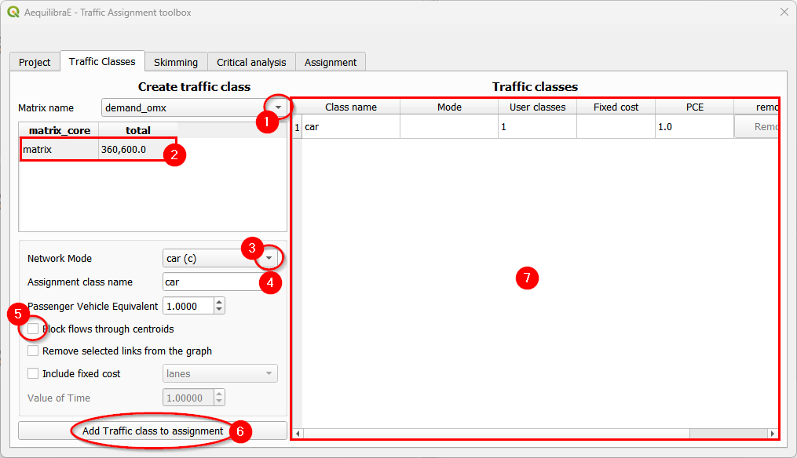

To select skims, we need to choose which fields/modes we will skim. If no mode appears
at the class field, you should have missed any configuration on the traffic classes tab
before. Let's continue with 'free_flow_time' and 'distance'. We select the field to skim
(1) and the class (2) and add it (3) to the skimming table, at the bottom. Let's skim
'free_flow_time' only for the last iteration by untoggling the 'blended' check box (4).

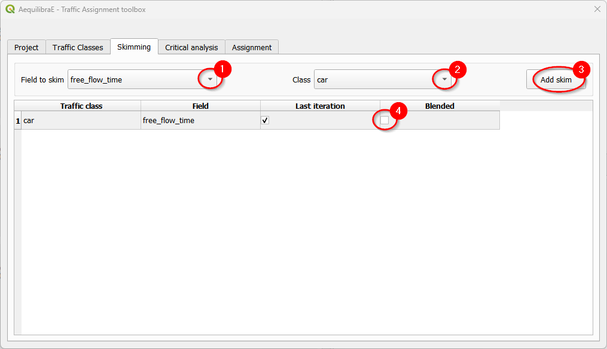

Let's repeat the skim selection process for 'distance', but now we'll use the blended
results.

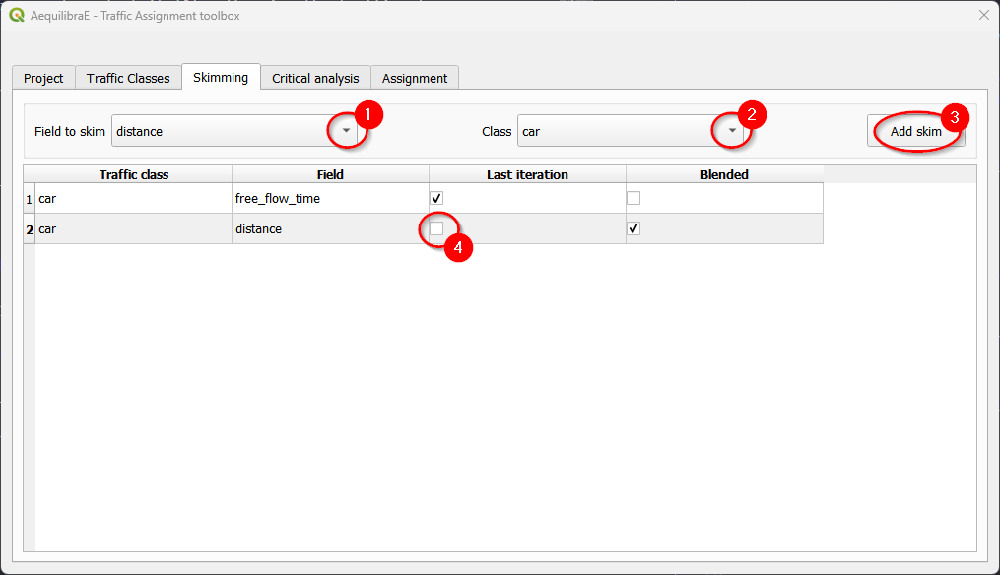

If you want to have skims for both final and blended, you don't have to untoggle any
check boxes!

Then, we can choose to run a select link analysis. Its default configuration is not
to select any links, so we have to toggle its *"Set select link analysis"* button (1).
The creation of queries for analysis consists in: create a name for the query,
select the travel direction, add the link ID, and click on *Add to query*, to temporarily
save the data to the query.

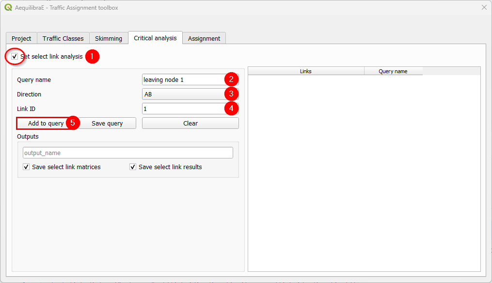

Adding more links to the previous query is straightforward. Select the direction
and the link ID, and press *Add to query* once again.

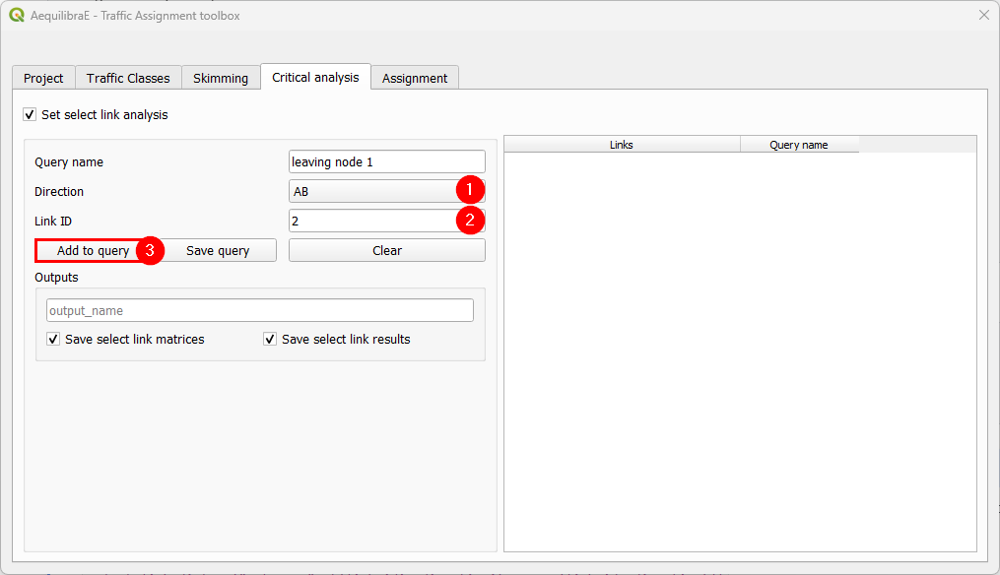

When we are done with the current query, we click on *Save query*, and notice that
the query with the selected links is going to appear in the right-hand side queries table.

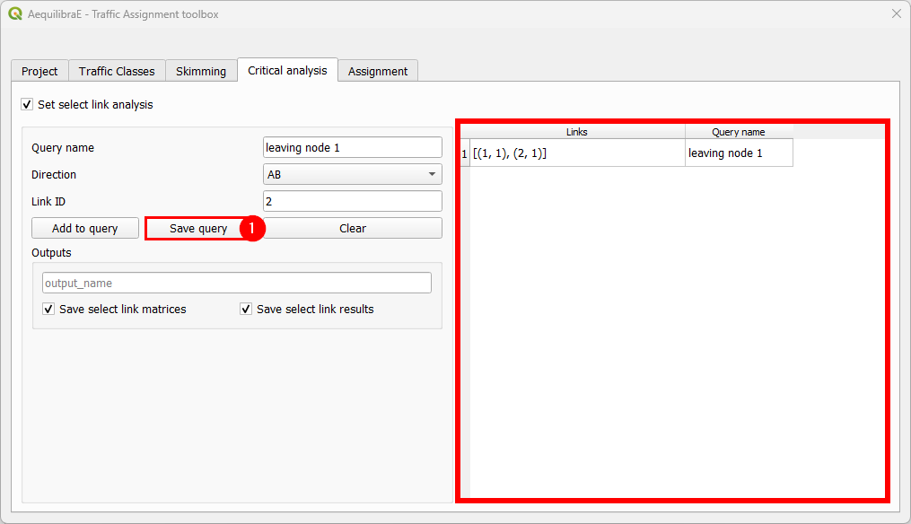

To finish the select link analysis step, we choose one name to save one or both of
the matrix and results files.

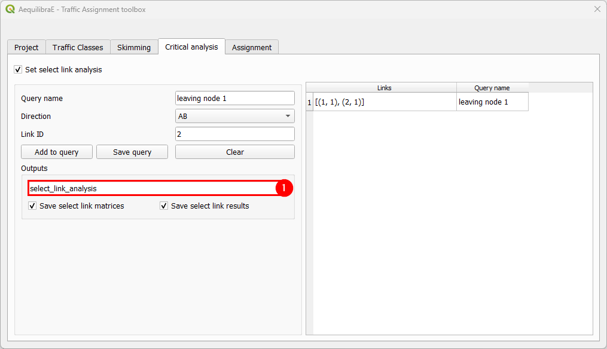

The final step is to setup the assignment itself, by selecting the algorithms, setting up
the relative gap and maximum number of iterations, volume-delay function, network information,
and the assignment output name. When configuring the parameters of the VDF function, it is
possible to use a value by typing it or an existing field. When configurations are done, just
click on the *"Assign"* button and wait for the results. When QAequilibraE finishes the
assignment procedure, the traffic assignment window automatically close.

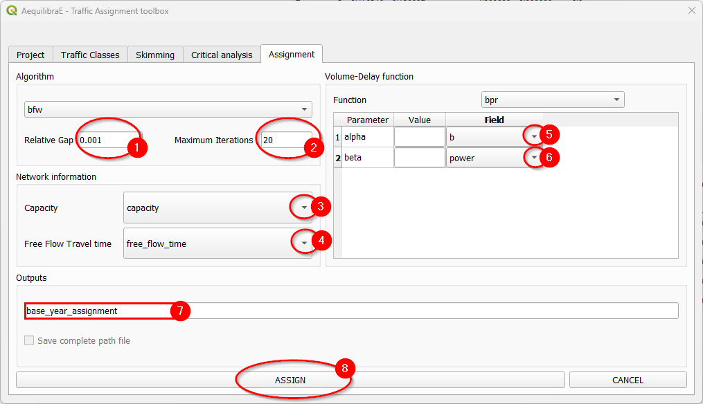

.. _usage-of-results-layer-join:

The result of the traffic assignment we just performed is stored in the results database
within the project folder. It can be easily accessed and loaded by clicking
**Mapping > Visualize data**, and a project data window will open. Go straight to the
*Results* tab (1), and select the desired result (2), let the *Join with layer* option checked,
and click in the *Load Result table as data layer* button at the bottom (3). The result table
layer will be automatically joined with the links layer and will appear at your QGIS
mapping canvas area.

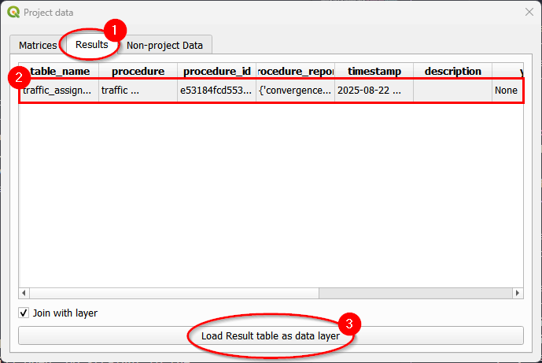

If you want to enhance your data visualization, now we can revisit the instructions for
:ref:`mapping_stacked_bandwidth`

Creating a YAML configuration file
----------------------------------

One update in QAequilibraE's Traffic Assignment is allowing the user to load the assignment
configurations from an YAML file. In this section we present how you can manually set up your
YAML file.

1. The main file keys are 'traffic_classes' and 'assignment': they are mandatory and contain
   the basics of traffic assignment configuration.

2. When configuring a traffic class, use lists with dictionaries. The item corresponds to the
   dictionary key and is going to be your traffic class name. If you have more than one traffic
   class, as in multi-class assignment, each class is configured in the same way.

3. For each traffic class, the fields 'skims', 'fixed_cost', and 'vot' are optional. If you
   are going to use any of them, make sure to properly fill the values. For 'skims', add the
   skim and which results are desired: final (results of the final iteration) or blended
   (averaged results for all iterations).

4. The 'select_links' section is completely optional, however if you are using it the fields 
   'output_name' and 'selection' are required. 'save_matrix' and 'save_results' defaults
   to ``True``. We encourage using them only if you don't want to save any of the outputs. The
   selection contains dictionaries whose keys are query names and the values are a list of lists
   containing the 'link_id' and 'link_direction' (check the :ref:`direction section <link_direction>` 
   here).

**Notice that all lines that are commented in the code below are optional.**

.. code-block:: yaml
    :caption: Traffic assignment configuration

    traffic_classes:
      - car:
          matrix_name: demand_omx
          matrix_core: matrix
          network_mode: c
          pce: 1.0
          blocked_centroid_flows: False
          # skims:
          #   free_flow_time: [final]
          #   distance: [blended]
          # fixed_cost: vot
          # vot: 1.05
    assignment:
      algorithm: bfw
      max_iter: 25
      rgap: 0.001
      vdf: BPR
      alpha: 0.15
      beta: 4.0
      capacity_field: capacity
      time_field: free_flow_time
      result_name: result_test_from_yaml
    # select_links:
    #   output_name: select_link_analysis_from_yaml
    #   save_matrix: True  # optional 
    #   save_result: True  # optional
    #   selection: # name with a list of lists as [[link_id, link_direction]]
    #     from_node_1: [[1, 1], [2, 1]]
    #     random_nodes: [[3, 1], [5, 1]]
