.. _trip_distribution:

Trip Distribution
=================

On the trip distribution menu, the user can perform Iterative Proportional Fitting (IPF)
with their available matrices and vectors, as well as calibrate and apply a Synthetic Gravity
Model.

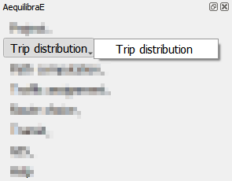

Unlike the other menus in QAequilibraE, all three procedures in trip distribution share some
configuring stepa. We'll go over each tab and, in the end, we'll run a basic workflow
using Sioux Falls example.

"*Load datasets*" is the first tab and contains a loading button and a dataset table at
the right side. Currently, QAequilibraE allows import dataset data from a ``*.csv`` or 
``*.parquet`` file or loading data from an open layer. This tab is configured for IPF and
Apply Gravity.

.. subfigure:: AB
    :subcaptions: below
    :align: center

    .. image:: ../images/trip_distribution/trip_distribution_1.png
        :alt: Load datasets
    
    .. image:: ../images/trip_distribution/trip_distribution_2.png
        :alt: Dataset file format

The second tab is "*Load matrices*", which is configured in all processes. It consists in
a table view of all matrices available in the project. 

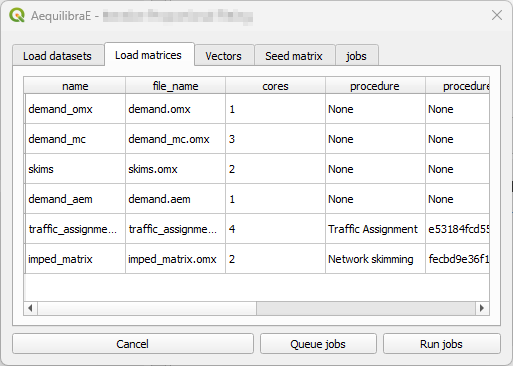

In the tab "*Vector*", we indicate the vector fields for computation. If no dataset was
loaded in the "*Load datasets*" tab, no fields are displayed here. This tab is configured for
IPF and Apply Gravity procedures.

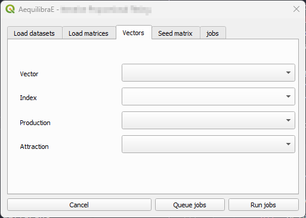

In the tab "*Impedance*" we select the matrix and matrix core that will be used for computation.
We configure this tab at the Apply Gravity procedure.

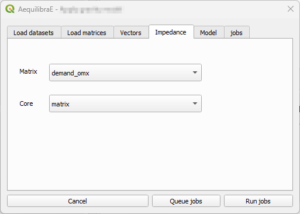

The tab "*Seed matrix*" (for IPF procedure) is analogous to the "*Observed matrix*" tab for the
Calibrate Gravity procedure, and allows the user to indicate the impedance/observed matrix.

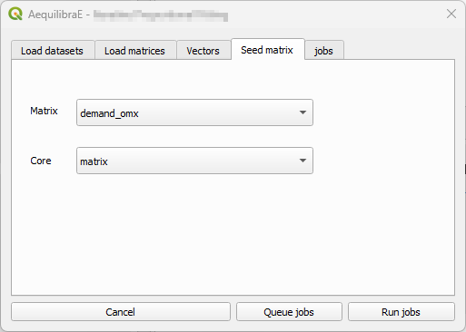

The tab "*Model*" exists for Calibrate and Apply Gravity procedures, however each procedure 
presents a different window layout. For the Calibrate Gravity, we choose the model's deterrence
function, while for the Apply Gravity, we can load the calibrated model parameters for use.

.. subfigure:: AB
    :subcaptions: below
    :align: center

    .. image:: ../images/trip_distribution/trip_distribution_7.png
        :alt: Model tab - Calibrate Gravity
    
    .. image:: ../images/trip_distribution/trip_distribution_8.png
        :alt: Model tab - Apply Gravity

Finally, the tab "*Jobs*", we can queue and/or check the jobs that are already queued and are
going to be executed, and run them!

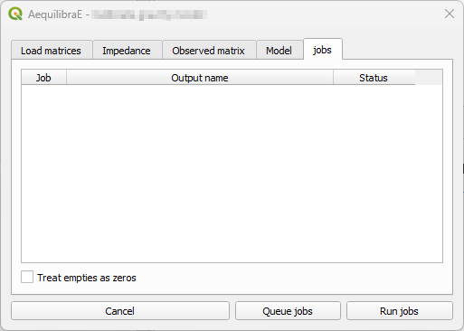

.. _trip_distribution_workflow:

Basic workflow
~~~~~~~~~~~~~~

We present a full forecasting workflow using the Sioux Falls example. We start creating the
skim matrices, running the assignment for the base-year, and then distributing these trips into
the network. Later, we estimate a set of future demand vectors which are going to be the input
of a future year assignnment.

This workflow is based on the AequilibraE Python 
`Forecast example <https://www.aequilibrae.com/latest/python/_auto_examples/traffic_assignment/plot_forecasting.html>`_.

Before running the trip distribution procedures, we encourage you to run the 
:ref:`traffic assignment procedure <traffic_assignment_workflow>` for the base-year.

Calibrate Gravity Model 
^^^^^^^^^^^^^^^^^^^^^^^
Now that we have the demand model and a fully converged skim, we can calibrate a
synthetic gravity model.

We click on Trip distribution in the AequilibraE menu and select the Calibrate
Gravity model option.

.. image:: ../images/trip_distribution/calibrate_gravity_1.png
    :align: center
    :alt: Calibrate Gravity menu

The first thing to do is to check if all matrices we need (skim and demand) are in
the project folder.

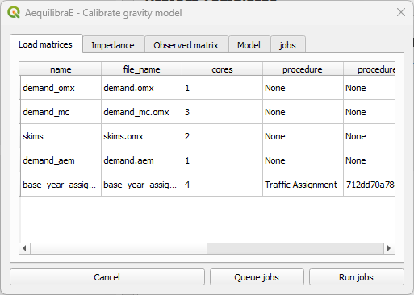

Select which matrix/matrix core is to be used as the impedance matrix.

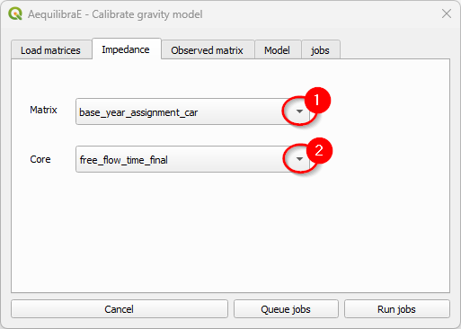

And which one corresponds to the observed (demand) matrix.

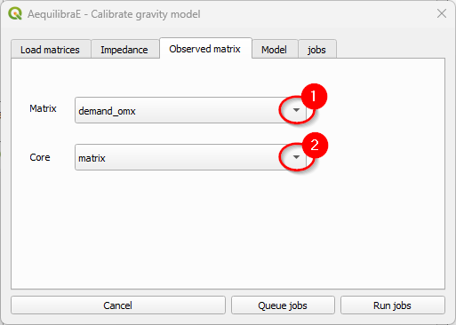

We then select which deterrence function we want to use (1) and choose a location to
store the model by clicking on *Queue jobs* (2). A new window will open and you can
choose your preferred place. Remember to pick up a place where you can easily find
the model files: we'll use them to apply the gravity model.

.. image:: ../images/trip_distribution/calibrate_gravity_5.png
    :align: center
    :alt: Calibrate Gravity - Queue negative exponential model

Let's queue another job. 

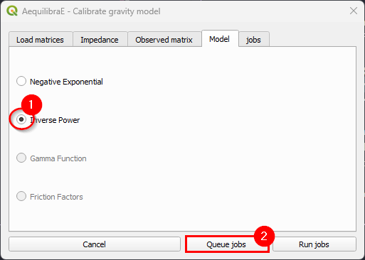

In the jobs tab, we can check all jobs we queued (1) and then run the procedures (2).
You need to click once in the button to execute all of them.

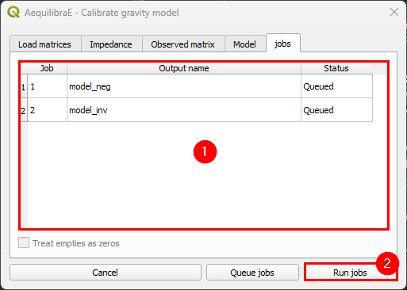

When the procedures are done, a window with each of the procedures report opens.
You can inspect the outputs and save them.

.. subfigure:: AB
    :subcaptions: below
    :align: center
    :gap: 8px

    .. image:: ../images/trip_distribution/calibrate_gravity_8.png
        :alt: Negative exponential procedure output 
    
    .. image:: ../images/trip_distribution/calibrate_gravity_9.png
        :alt: Inverse power procedure output

The resulting file is of type ``*.mod``, but that is just a YAML (text file).

.. subfigure:: AB
    :subcaptions: below
    :align: center

    .. image:: ../images/trip_distribution/calibrate_gravity_11.png
        :alt: Negative exponential model 
    
    .. image:: ../images/trip_distribution/calibrate_gravity_10.png
        :alt: Inverse power model

Iterative Proportional Fitting (IPF)
^^^^^^^^^^^^^^^^^^^^^^^^^^^^^^^^^^^^
It is possible to balance the production/attraction vectors using Iterative Proportional Fitting
(IPF). Let's click on the Trip Distribution menu and select Iterative Proportional Fitting.

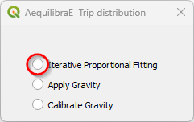

There are three different ways to load a vector's data: loading a ``*.csv`` or ``*.parquet``
file or loading data from an open layer. Click on the *Load* button under "Data sets" (1). A new
window opens. Loading the vector from a file is quite the same: select your preferred file format
in the menu (2), and click *Load* (3), pointing to the location of the vector file in your machine.

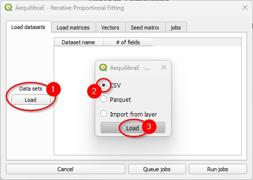

Case you are loading from an open layer, just click *Import from layer*, point the available data
layer (1), and the name of its index column (2). Let's choose to only *Use data* (3).

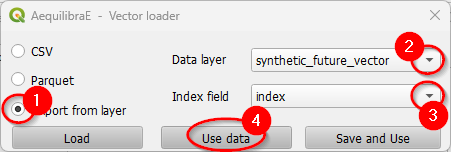

When the vector is loaded, it will appear in the *Load datasets* table.

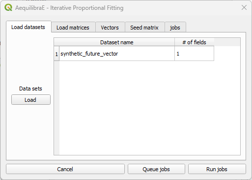

You can now select the production/attraction (origin/destination) vectors. If your data comes
from a QGIS layer, you'll notice that the *Index* list is deactivated because the data index
was configured when loading the data.

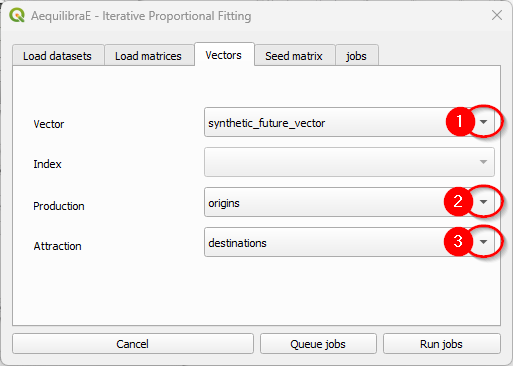

And select the seed (demand) matrix to be used.

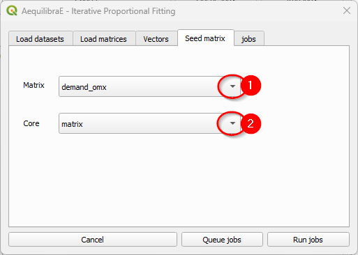

To run the procedure, queue the job (and select the where the output file will be saved).
You'll notice that a job with the output file name will appear in the jobs table with a
status *queued* (2). Finally, press *Run jobs* (3).

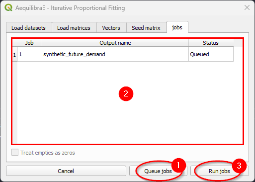

After the job is completed, a new window showing its procedure report will open. We can close it
after checking the procedure report.

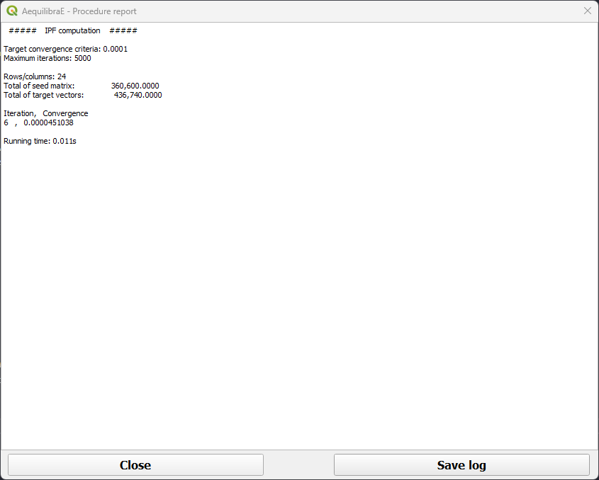

.. important::

    Production and Attraction vectors **must be** balanced before running IPF.

If you want to use the same data as we did, you can save the following code block as a CSV file
in your machine!

.. code-block::
    :caption: Synthetic future vector

    index,origins,destinations
    1,5220.000000,29197.959184
    2,20648.000000,41952.857143
    3,2204.000000,23665.714286
    4,7656.000000,12293.877551
    5,10208.000000,2766.122449
    6,57420.000000,31349.387755
    7,25636.000000,6146.938776
    8,2784.000000,5071.224490
    9,10440.000000,4302.857143
    10,2668.000000,8298.367347
    11,18908.000000,18748.163265
    12,67164.000000,58242.244898
    13,10440.000000,59471.632653
    14,29348.000000,12447.551020
    15,26912.000000,15060.000000
    16,14848.000000,4302.857143
    17,14848.000000,10449.795918
    18,21344.000000,15213.673469
    19,8236.000000,13523.265306
    20,13456.000000,31195.714286
    21,19140.000000,13369.591837
    22,464.000000,307.346939
    23,11716.000000,9681.428571
    24,35032.000000,9681.428571

Apply Gravity Model
^^^^^^^^^^^^^^^^^^^
If one has future matrix vectors (there are some provided with the example
dataset), they can either apply the Iterative Proportional Fitting (IPF)
procedure available, or apply a gravity model just calibrated. Here we present
the latter.

.. image:: ../images/trip_distribution/apply_gravity_1.png
    :align: center
    :alt: Apply Gravity menu

With the menu open, let's load the dataset(s) with the production/origin and
attraction/destination vectors. We can add data into the model by loading a file or using
an open layer, just like the IPF procedure. Let's click to load the dataset (1). A new window
opens. Loading the vector from a file is quite the same: select your preferred file format in
the menu (2), and click *Load* (3), pointing to the location of the vector file in your
machine.

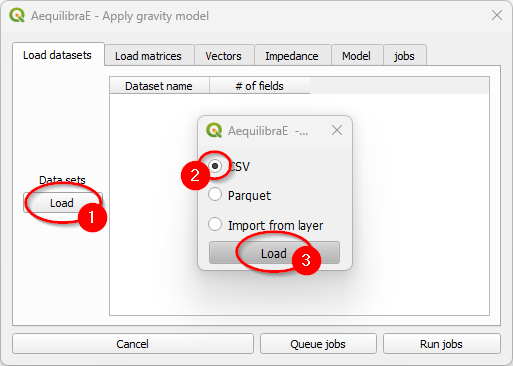

Case you are loading from an open layer, just click *Import from layer*, point the available data
layer (1), and the name of its index column (2). Let's choose to only *Use data* (3).

.. image:: ../images/trip_distribution/apply_gravity_3.png
    :align: center
    :alt: Apply gravity - Load dataset from layer

When the vector is loaded, it will appear in the *Load datasets* table.

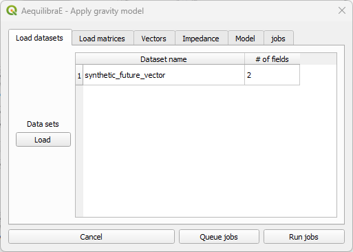

Select the production/attraction (origin/destination) vectors.

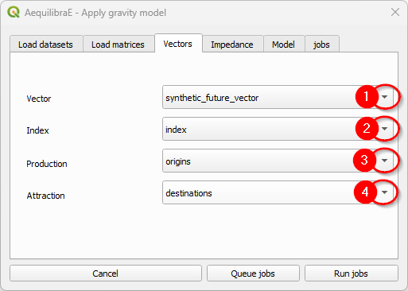

And the impedance matrix to be used. We can select one matrix core to use in computation.

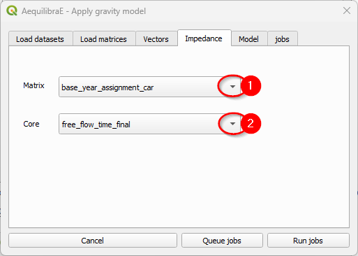

The last input is the gravity model itself, which can be done by loading a model that has
been previously calibrated, or by selecting the deterrence function from the drop-down menu
and typing the corresponding parameter values. To select a deterrence function, select one
function among the available ones (1) and configure the values for the fields *alpha* and
*beta* (steps 2 ane 3). For each function you select, queue it into the jobs (4) table.

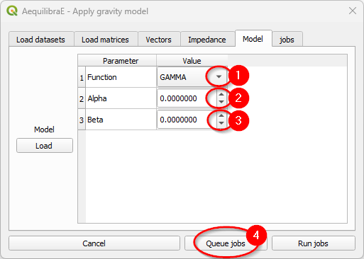

As we already have calibrated models, we'll load its configurations. When clicking *Load*
(1) a new window opens. Point to the path where your ``*.mod`` file is stored, and once its
loaded, you'll notice that the parameters in the table view now correspond to the model data (2).
Queue the jobs by hitting the *Queue jobs* button (3).

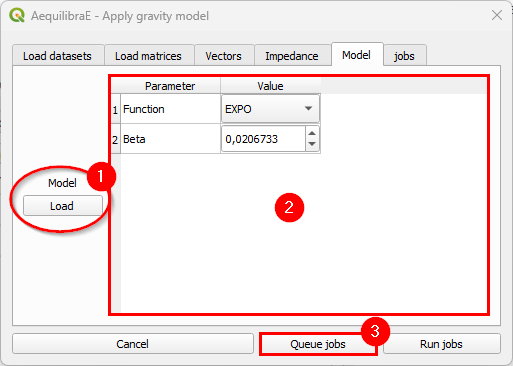

It is possible to check the jobs qeued before running the model in the tab *Jobs* (1). If all
jobs look ok, just click on the *Run jobs* button (2).

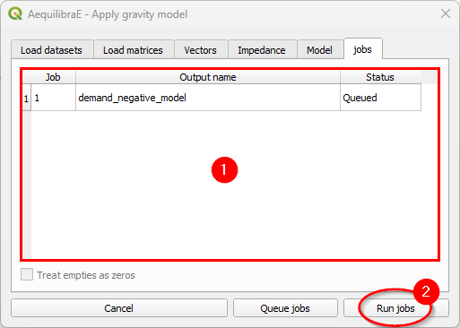

We have to repeat this process of configuring, loading the calibrated models and running the
jobs twice: one for each model we have!

Once the process is finished, a new window with the procedure report output opens. You can
check its output and close it.

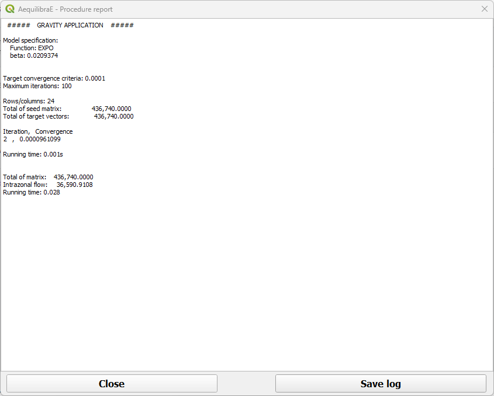

The result of this future demand matrix can also be assigned, which is what we will generate
the outputs being used in the :ref:`scenario comparison <mapping_scenario_comparison>`. To do so, run
a :ref:`traffic assignnment workflow <traffic_assignment_workflow>` using the
'demand_negative_model' as input! Try it on!
