Processing Tools
================

AequilibraE's plugin functionalities are also available in a processing plugin.
The processing plugin is automatically installed with QAequilibraE and allows you to perform
several tasks, such as creating project from links, exporting matrices, and much more.

To find AequilibraE's processing plugin, click on the **Processing** panel and select **Toolbox**.
You can also use the available QGIS shortcut to open the Toolbox window.

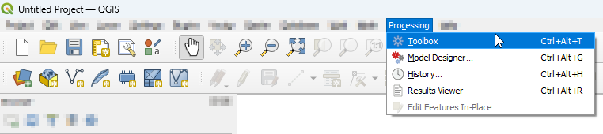

At the bottom of the window, you'll find the AequilibraE logo and the available functions.
The functions are divided into groups, following the same logic as the AequilibraE widget
menu. Notice that all AequilibraE functionalities are available for processing, but not
all processing tools exist at the main AequilibraE menu.

.. subfigure:: AB
    :align: center

    .. image:: images/processing_provider/processing_provider_toolbox-1.png
        :alt: Toolbox General

    .. image:: images/processing_provider/processing_provider_toolbox-2.png
        :alt: Toolbox Detailed

In the following subsections, we'll go over all menus and its functionalities. As the
provider menus are ordered alphabetically, we'll display them in the same order. 

Data
----
With Data tools, it is possible to import/export matrices to/from the project, as
well as perform matrix calculations and generate a trip length distribution output
usig project data.

.. warning::

    Support for AequilibraE Matrix (AEM) files will be removed in a future version.

.. _importing_matrices:

Importing matrices
~~~~~~~~~~~~~~~~~~
It is also possible for the user to import matrices from an open layer to a project. This can be done by clicking 
**Data > Import Matrices** and properly indicating the fields in the new window. First click *Load*
and then *Save*. A new window will open and you can point to the project matrices folder. To take a look in the
matrix you just imported, you can upload the matrix table and display it as shown in the last topic.

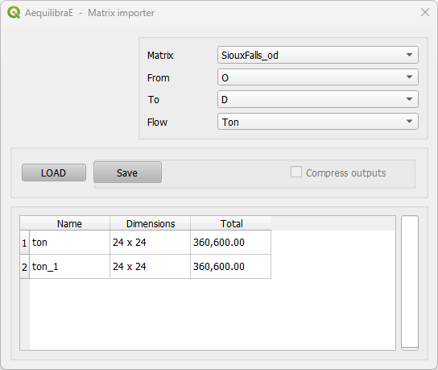

Export matrices
~~~~~~~~~~~~~~~
The *Export matrices* tool is analogous to the *Export* button in the matrix viewer 
(see: :ref:`this figure <fig_data_visualize_matrices>` for more details). 
Its usage is straightforward: select the matrix you want to export, specify the path
on your machine to store the file, and select its output format. Only \*.aem and \*.omx files can 
be used as input, and the output format can be either one of \*.aem, \*.omx, or \*.csv.

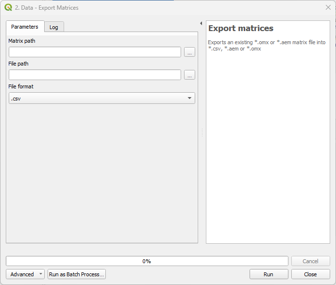

Matrix calculator
~~~~~~~~~~~~~~~~~
Under the hood, this tool performs several matrix calculations using NumPy. Its output is 
an AequilibraE matrix stored in the file path you provide. Notice that not all matrices
operations available in NumPy are also available here. We currently handle the following
operations.

* ``+``, ``-``, ``*``, ``/``
* ``min``, ``max``, ``abs``
* ``ln``, ``exp``, ``power``
* ``null_diag``, ``T``

To be more effective in your calculation, please use the brackets to separate the operations
in the desired order of execution.

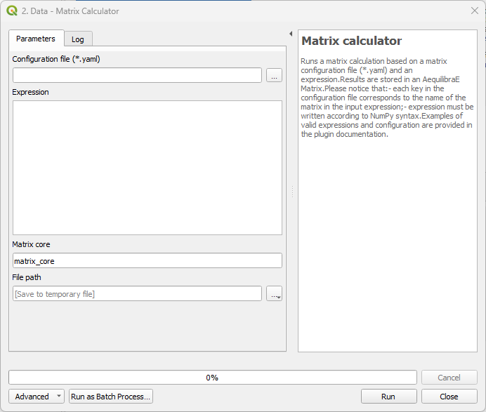

The following code blocks present, respectively, examples of a matrix input configuration for 
the YAML file and an expression that can be used for calculation. 

.. code-block:: yaml
    :caption: Matrix configuration

    # For each matrix used for calculation
    - matrix_name1:
        matrix_path: path to file
        matrix_core: specifiy the core name

.. code-block:: yaml
    :caption: Expression

    (matrix_name1 - matrix_name2).T

Trip length distribution
~~~~~~~~~~~~~~~~~~~~~~~~
This tool generates a Trip Length Distribution (TLD) plot for a pair of demand and skim
matrices and their selected cores.

.. important::

    An open AequilibraE project is required for this tool to work.

.. image:: images/processing_provider/processing_provider_tld.png
    :align: center
    :alt: Processing provider TLD

Mapping
-------
With Mapping tools, the user can easily visualize project data. For the tools not presented
here, please refer to the :ref:`Mapping tools module <mapping_tools>` documentation.

Simple tag
~~~~~~~~~~
**Mapping > Simple tag** works as a spatial join tool in AequilibraE that allows you
to join useful information between layers.

Suppose you have a nodes layer with a 'name' column only with ``NULL`` values,
and a zoning layer with an analogous column 'name' but filled with actual names.
We can join the information from the zoning layer into the nodes layer using 
Simple tag.

We start selecting the layer and the field from which we want to import the
data, and then selecting the layer and the field we want to 'paste' the data.
Notice that depending on the operation one want to perform, not all methods are
available.

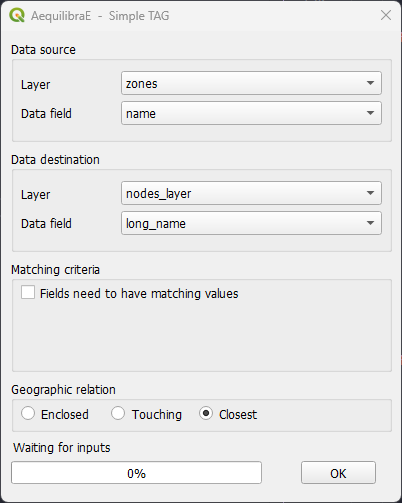

Be aware that the existence of triggers in the project database might affect the
performance of Simple tag.

Model Building
--------------
With the Model Building tools, it is possible to effectively build an AequilibraE model,
and to do so, there are some options, such as creating project from Open Street Maps or
using your existing layers. Model Building also provides options for editing the model's
network.

.. _adding_centroids:

Add centroid connectors
~~~~~~~~~~~~~~~~~~~~~~~
Starting in version 0.6 of AequilibraE, centroid connectors can now only be
added to
`AequilibraE projects <https://www.aequilibrae.com/latest/python/modeling_with_aequilibrae/project.html>`_,
and no longer generates new layers during the process.

Before we describe what this tool can do for you, however, let's just remember
that there is a virtually unlimited number of things that can go awfully wrong
when we edit networks with automated procedures, and we highly recommend that
you **BACKUP YOUR DATA** prior to running this procedure and that you inspect
the results of this tool **CAREFULLY**.

The *GUI* for this procedure is fairly straightforward, as shown below.

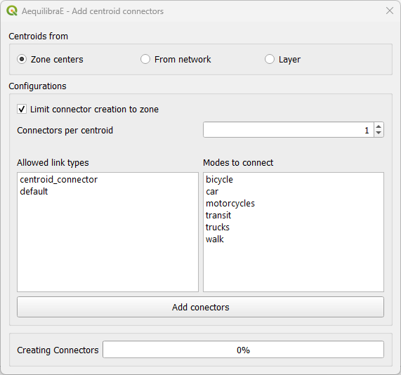

When creating centroids from zone centers, one can choose to limit the connector
to the zone or not. Plase notice if one choose to limit the connector creation to a 
zone that has fewer nodes connected to links of the required types than the number of connectors will result 
in fewer connectors being created than desired.

One would notice that nowhere in the *GUI* one can indicate which modes they
want to see the network connected for or how to control how many connectors per
mode will be created. Although it could be implemented, such a solution would
be convoluted and there is probably no good reason to do so.

Instead, we have chosen to develop the procedure with the following criteria:

* All modes will be connected to links where those modes are allowed.
* When considering number of connectors per centroid, there is no guarantee that
  each and every mode will have that number of connectors. If a particular mode
  is only available rather far from the centroid, it is likely that a single
  connector to that mode will be created for that centroid
* When considering the maximum length of connectors, the *GUI* returns to the
  user the list of centroids/modes that could not be connected.

Notice that in order to add centroids and their connectors to the network,
we need to create the set of centroids we want to add to the network in a
separate layer and to have a field that contains unique centroid IDs. These IDs
also cannot exist in the set of node IDs that are already part of the map.

Add links from layer to project
~~~~~~~~~~~~~~~~~~~~~~~~~~~~~~~
This tool allows you to add links from a vector layer to your existing project network.
The fields usage is straightforward: in *Project path*, you add the project's path in your
machine, then select a vector layer that corresponds to the new links you want to add to
your project, and indicate the layer fields that correspond to the link type, direction, and
modes. Notice that this tool doesn't require a node layer, nor does it require fields such
as ``a_node`` or ``b_node``, as it will use the existing numbering in the project.

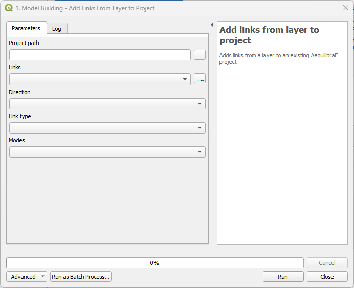

.. _add-zoning-data:

Add zoning data
~~~~~~~~~~~~~~~
It is possible to import to AequilibraE project your own zoning system in case
you already have one. Currently, AequilibraE only supports one projection system,
which is the EPSG:4326 (WGS84), so make sure your zone layer is in this projection.

To add your zones to the active project, go to **Model building > Add zoning data**, 
select the zoning layer you want to add to the project, select weather you
want to migrate the data and the respective layer field in the zoning layer, and
finally click on process.

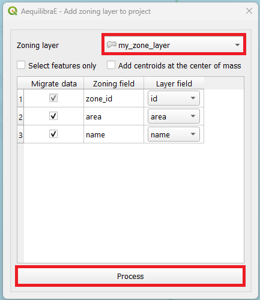

Collapse links
~~~~~~~~~~~~~~
This tool allows you to collapse one or more links into nodes, adjusting the network in
the neighborhood if necessary.

The input for the tool consists in a folder containing an AequilibraE project and a
the link IDs of the links you want to collapse separated by a comma.

.. image:: images/processing_provider/processing_provider_collapse_links.png
    :align: center
    :alt: Processing provider collapse links

.. _create_project_from_osm:

Create project from OSM
~~~~~~~~~~~~~~~~~~~~~~~
The first feature is the capability of importing networks directly from
`Open Street Maps <https://www.openstreetmap.org/>`_ into AequilibraE's efficient
TranspoNet format. This is also time to give a HUGE shout out to
`Geoff Boeing <http://www.geoffboeing.com/>`_, creator of the widely used Python
package `OSMNx <https://osmnx.readthedocs.io/en/stable/>`_. For several weeks I
worked with Geoff in refactoring the entire OSMNx code base so I could include
it as a submodule or dependency for AequilibraE, but its deep integration with
`GeoPandas <https://geopandas.org/en/stable/index.html>`_ and all the packages it depends on (Pandas,
Shapely, Fiona, RTree, etc.), means that we would have to rebuild OSMNx from the
ground up in order to use it with AequilibraE within QGIS, since its Windows
distribution does not include all those dependencies.

For this reason, I have ported some of Geoff's code into AequilibraE
(modifications were quite heavy, however), and was ultimately able to bring this
feature to life.

.. note::
   Importing networks from OSM is a rather slow process, so we recommend that
   you carefully choose the area you are downloading it for. We have also
   inserted small pauses between successive downloads to not put too much
   pressure on the OSM servers. So be patient!!

Importing networks from OSM can be done by choosing an area for download,
defined as the current map canvas on QGIS...

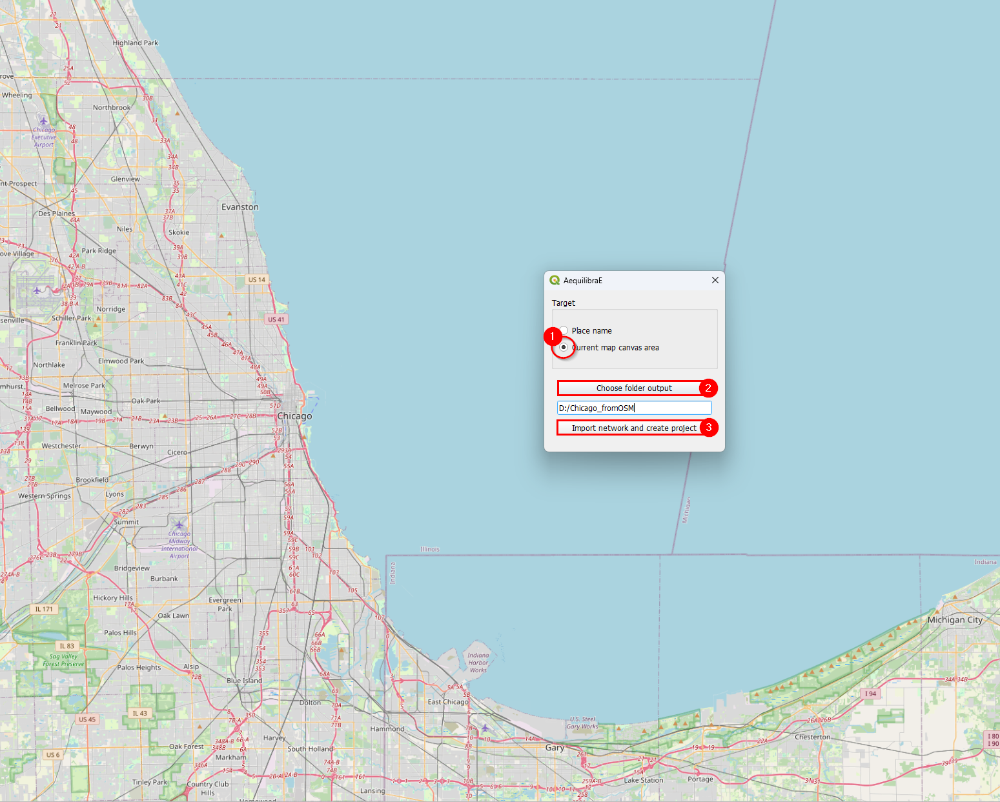

... or for a named place.

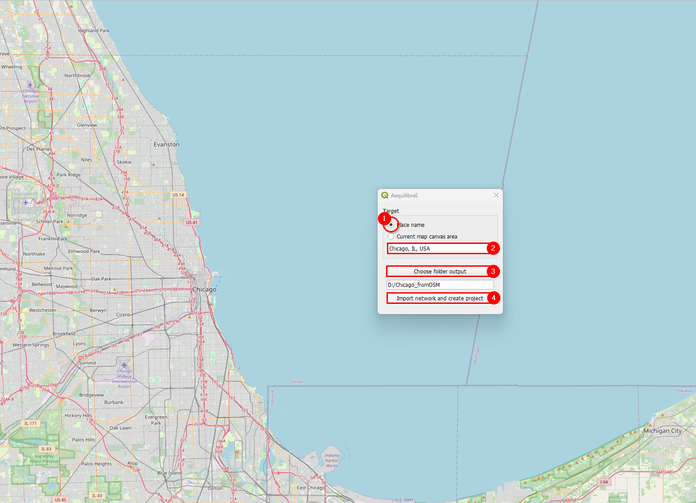

.. _project_from_layers:

Project from layers
~~~~~~~~~~~~~~~~~~~
The AequilibraE project can also be bootstrapped from existing line and node
layers obtained from any other source, as long as they contain the following
required field for the conversion:

* link_id
* a_node
* b_node
* link direction
* length
* speed
* allowed modes
* link type

These requirements often create quite a bit of manual work, as most networks
available do not have complete (or reliable) information. Manually editing the
networks might be necessary, which is common practice in transport modelling.

Before creating a project from the layer, you can understand how to prepare the
layers for this task on the page
:ref:`Preparing a network <network_preparation_page>`.

Basic workflow
^^^^^^^^^^^^^^
Accessing **Model building > Create Project from Layers**, the user is
presented with the following screen.

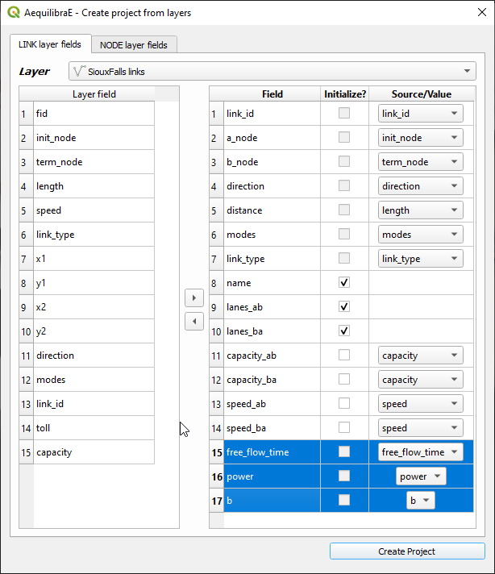

The first 7 fields for links are mandatory, and one needs to associate the
corresponding layer fields to the network fields.

The other fields that will be listed on the left side come from the parameters
file (see the manual for that portion for more details), but the user can add
more fields from the layer, as all of them are listed on the left side of the
screen

In the case of the nodes layer, only two fields are mandatory.

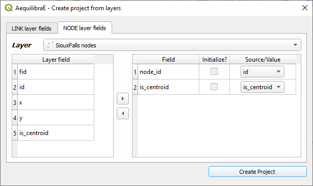

After filling all fields, it is just a matter of saving it!

After running this tool a sqlite file (spatialite enabled) will be created and
you can edit the network (create, move or delete links and nodes) and both
layers (including node *ID* and *A_Node*/*B_Node* fields) will remain
consistent with each other.

.. _network_preparation:

Network preparation
~~~~~~~~~~~~~~~~~~~
When preparing your project network, you might face there are two distinct situations:

1. **User has only the network links**: This is the case when one exports only links 
   from a transportation package or downloads a link layer from Open Street Maps or a 
   government open data portal and want to use such network for path computation. 
   This tool then does the following:

   * Duplicates the pre-existing network in order to edit it without risk of data corruption
   * Creates nodes at the extremities of all links in the network (no duplicate nodes at the 
     same latitude/longitude)
   * Adds the fields *a_node* and *b_node* to the new link layer, and populate them with the 
     *IDs* generated for the nodes layer

2. **User has the network links and nodes but no database field linking them**: In case one 
   has both the complete sets of nodes and links and nodes for a
   certain network (commercial packages would allow you to export them separately),
   you can use this tool to associate those links and nodes (if that information
   was not exported from the package). In that case, the steps would be the following:

   * Duplicates the pre-existing network in order to edit it without risk of data corruption
   * Checks if the nodes provided cover both extremities of all links from the layer provided.
     Node IDs are also checked for uniqueness
   * Adds the fields *a_node* and *b_node* to the new link layer, and populate them with the 
     *IDs* chosen among the fields from the nodes layer

The *GUI* for these two processes can be accessed in the AequilibraE menu **Model
Building > Network Preparation**, and it looks like this:

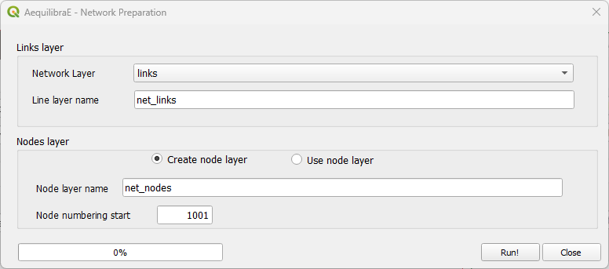

In this case we chose to add nodes with IDs starting in 1,001, as we will
reserve all nodes from 1 to 1,000 for centroids, external stations and other
special uses (we are not planning to use all that range and that is not
necessary, but the numbering gets quite neat that way).

Network simplifier
~~~~~~~~~~~~~~~~~~
This tool allows you to simplify the network, merging short links into larger ones or
turning links into nodes, and save these changes into the project.

The input for the tool consists in a folder containing an AequilibraE project.

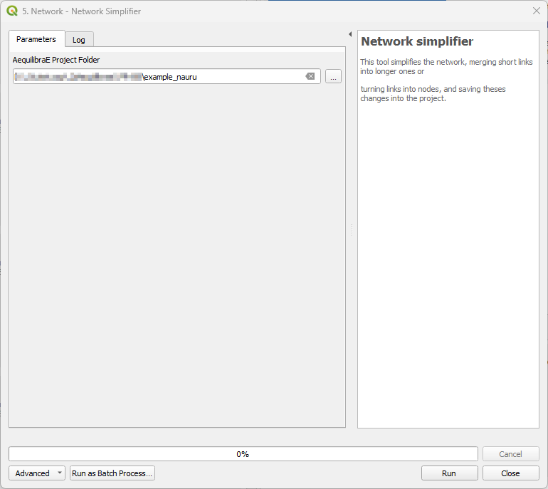

Path computation
----------------
Please refer to the :ref:`Path computation module <paths_procedures>` documentation.

Project
-------
In the project menu, the user can perform actions such as open/close project, create
examples, run procedures, or check parameter and log files. For the tools not presented
here, please refer to the :ref:`Project <aequilibrae_project>` documentation.

.. _create_example:

Create example
~~~~~~~~~~~~~~
AequilibraE has three different example sets one can use as learning tool, and they were all
made available within the QGIS ecosystem.

Within **Project > Create example**, select one of the available models, the desired
location of the output folder, and just press *Create*. The window will close automatically
and you can open the project folder in the Project tab.

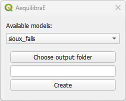

Log file
~~~~~~~~
The log file contains information about which actions took place and when they happened.
For example, after you :ref:`create a project from OSM <create_project_from_osm>`,
if you access the log file, you are going to see something like the figure below,
containing the sequence of steps followed to import the OSM network. If you wish to
access this file later on, it is also possible to save this log file locally in your machine,
using the **save to disk** button in the lower left corner of the log file box.

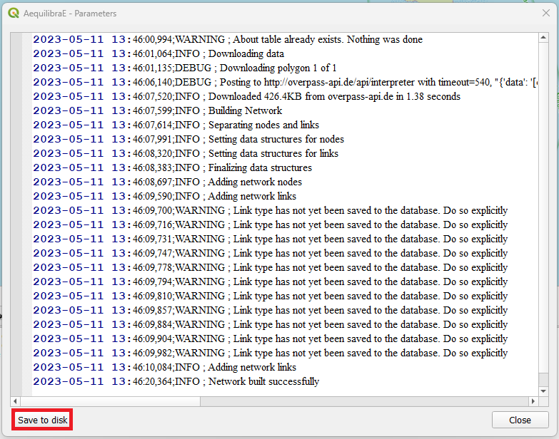

.. _parameters_file:

Parameters
~~~~~~~~~~
The parameters file is part of the AequilibraE package for Python, so all the
reference documentation for this section can be found in its
`Python companion page <https://aequilibrae.com/latest/python/modeling_with_aequilibrae/parameter_file.html>`_.

The QGIS plugin, however, has a nice interface to view and edit the parameters
file, which can be accessed through **Project > Parameters**. This
interface, depicted below, allows one to edit and validate parameters before
submitting them as the new parameter file for all AequilibraE procedures.

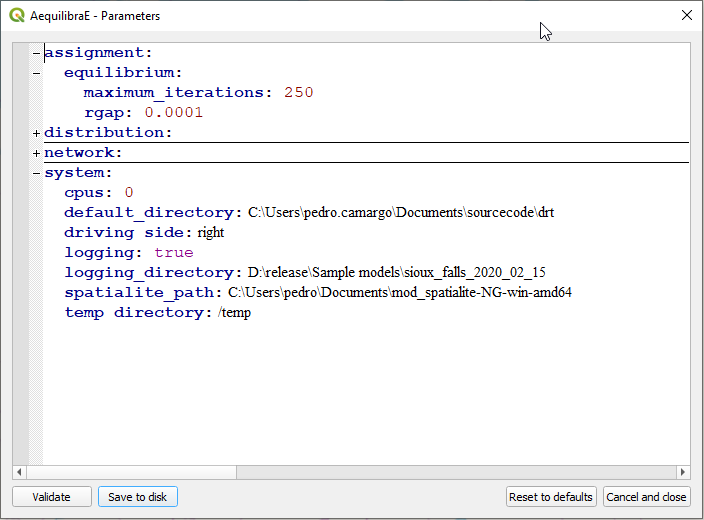

Route choice
------------
Please refer to the :ref:`Route choice <route_choice>` documentation.

Routing
-------
AequilibraE's routing allows the user to run a Travelling Salesman Problem (TSP),
using a selected set of nodes or the centroids of a network. 

Its usage is straightforward. For Sioux Falls, for example, we would select the
centroids of the network, and minimize the distance travelled by car. It is also
possible to choose the start node of our TSP (we'll let node_id 1 to be the starting
node, but it could be any available node), and indicate we want to see the result in
a new layer.

Our prompt box would look like this:

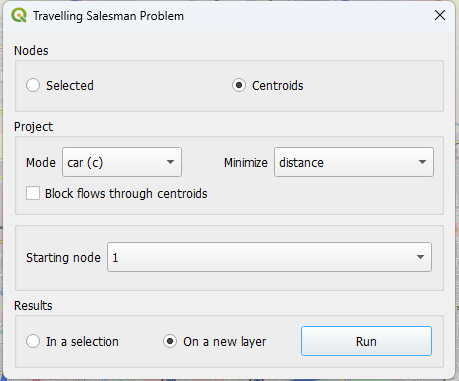

When AequilibraE is done solving the TSP, it provides a procedure report, like the
one in the figure below. You can export the procedure report in a .txt file if you 
wish, by clicking on the lower right button in the window. Otherwise, you can just
close this window (the TSP sequence can be found in the TSP stops layer).

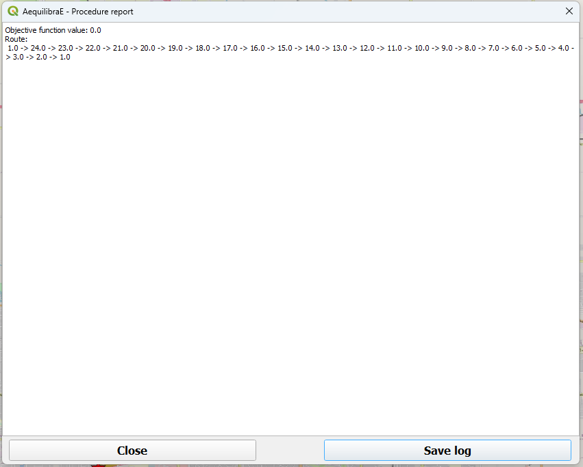

And as we chose to display the result in a new layer, it would look like the figure below. 
Please note that the TSP stops are labeled according their sequence.

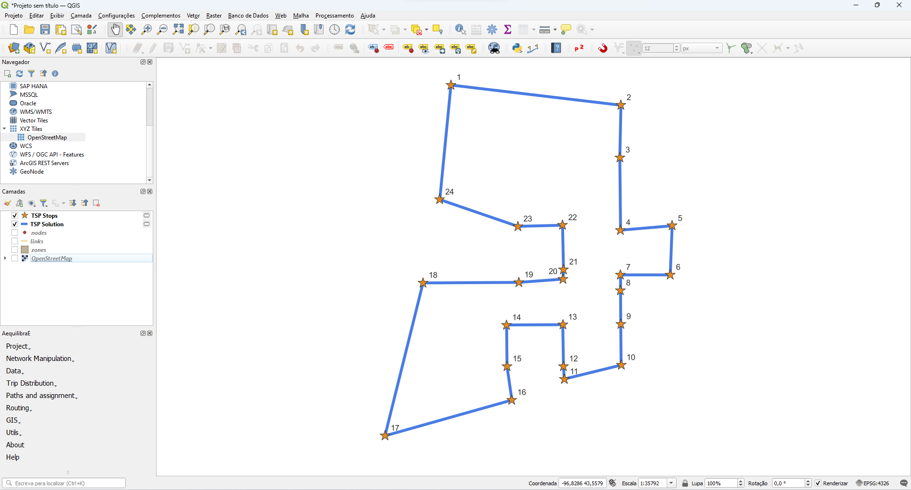

.. note::

    TSP is a well-known optimization problem and it has already been implemented in several
    different software and programming languages. However, the main problem related to
    TSP is related to its size (hence its complexity). This means that as we increase the 
    number of stops we want to travel to, the software will take much longer to provide you
    with an answer, and in some cases, it might also crash.

Traffic Assignment
------------------
Please refer to the :ref:`Traffic Assignment module <traffic_assignment_procedures>` documentation.

Transit
-------
Please refer to the :ref:`Transit module <transit_procedures>` documentation.

Trip distribution
-----------------
Please refer to the :ref:`Trip distribution module <trip_distribution>` documentation.