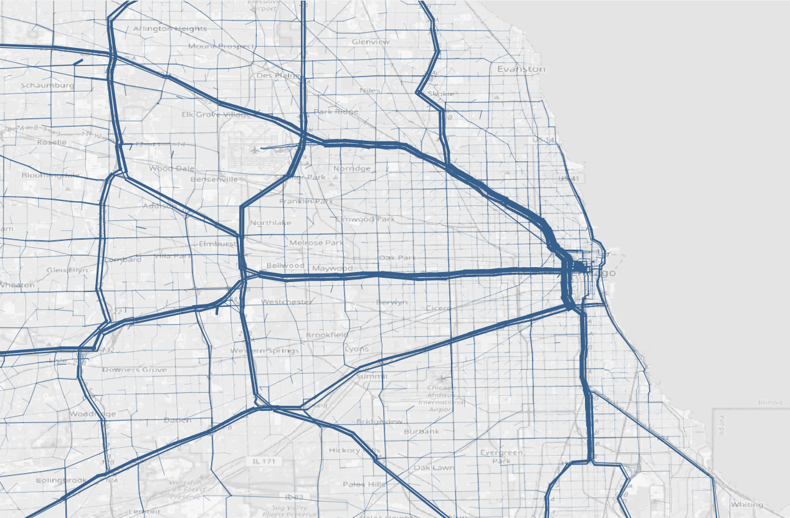
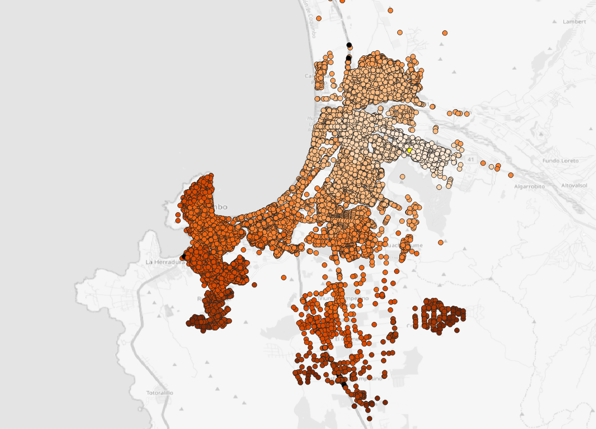

# Summary

`QAequilibraE` is a user-friendly graphical interface for transportation modelling that runs as a plugin
within QGIS, the popular open-source geographic information system. Built on top of AequilibraE, a
comprehensive Python package for transportation analysis, `QAequilibraE` makes transportation
modelling accessible to both newcomers and experienced practitioners who need efficient tools for
data visualization and analysis.

Transportation modelling helps urban planners, engineers, and researchers understand how people and
goods move through cities and regions. This involves analyzing travel patterns, predicting traffic
flows, and evaluating the impact of new infrastructure or policy changes. `QAequilibraE` simplifies
these complex analyses with intuitive interfaces that integrate seamlessly with QGIS's
mapping capabilities.

The plugin enables users to build transportation models from scratch using existing QGIS layers or
by importing data from OpenStreetMap. Key features include network preparation tools, traffic zone
creation, and advanced modelling capabilities such as trip distribution analysis, static traffic assignment,
route choice modelling, and public transit frequency-based assignment. Additionally,
`QAequilibraE` offers unique visualization tools, scenario comparison features, and support for
multiple languages, taking advantage of the broader QGIS ecosystem.

# Statement of need

Traditional commercial transportation modelling software presents some limitations: high licensing
costs that exclude many potential users, proprietary algorithms that prevent methodological
transparency and reproducibility, limited customization options that restrict research innovation,
and a closed-source nature that makes it impossible to verify or extend functionality. These 
limitations are particularly problematic for academic research, where reproducibility and 
methodological transparency are paramount. This was the cornerstone for building `QAequilibraE`.

Although there are other open-source alternatives for transportation modelling, many of them
might require substantial programming expertise, imposing barriers for practitioners, academic
researchers, and urban planners who require more accessible tools. By integrating AequilibraE with QGIS, `QAequilibraE`
leverages an existing ecosystem familiar to many spatial analysts while providing specialized
transportation modelling capabilities that are not available in general-purpose GIS software.

# Implementation and key features

`QAequilibraE` is implemented as a QGIS plugin using Python, following established QGIS plugin
development standards and modern software engineering practices, including automated testing,
continuous integration, and comprehensive documentation, ensuring reliability and maintainability
for long-term research and practice applications.
The plugin architecture separates the user interface from its computational core, which is mainly provided by the
AequilibraE Python package. The development workflow includes automated testing across
multiple platforms, continuous integration using GitHub Actions, and automated documentation
generation. The plugin dependencies are automatically installed before the first use with
the users' consent, providing error messages if applicable.

Through its interface, `QAequilibraE` makes a range of tools available, among which should be
highlighted the following:

- Trip distribution, with calibration and application of gravity models, and iterative
  proportional fitting (IPF) [@Ortuzar2011].
- Traffic assignment with all-or-nothing (AoN), method of successive averages (MSA), 
  Frank-Wolfe method (FW) and its modifications conjugate Frank-Wolfe (CFW) and
  bi-conjugate Frank-Wolfe (BFW) methods [@Mitradjieva2013; @Ortuzar2011]. 
- Route choice based on Path-Size Logit [@Ramming2002]
- Route choice set generation with breadth first search on link elimination (BFS-LE) [@RieserSchussler2013],
  link penalization (LP), or a hybrid approach of BFS-LE with link penalization.
- Transit skimming and assignment [@Spiess1989; @Bell2009]

Despite the traffic modelling tools, some features are only available as part of the
QGIS ecosystem, of which:

- Visualization of skims or traffic analysis zones (TAZ) data;
- Run a travelling salesman problem (TSP);
- Graphical scenario comparison;
- Iterative exploration of general transit feed specifications (GTFS);
- Internationalization to other languages with guaranteed complete translation to Brazilian Portuguese and other languages depending on volunteer translators.

# Availability

The latest stable version of `QAequilibraE` is available through the official QGIS plugin
repository and can be installed directly through the QGIS plugins menu. Comprehensive
documentation is available at `https://www.aequilibrae.com/develop/qgis/index.html`,
including installation instructions and example tutorials.

# Plotting Examples

  
*Figure 1: traffic assignment*

  
*Figure 2: skim viewer*

# Acknowledgements

We acknowledge contributions from Outer Loop Consulting, ADEME, La Fabrique des Mobilités,
EGIS France, and the Brazilian Institute of Applied Economics Research (IPEA) for 
partially-funding the development of the plugin.

# References
